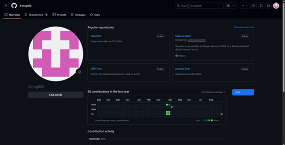
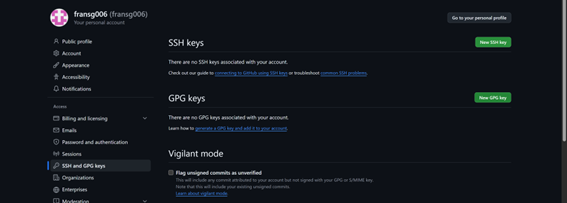
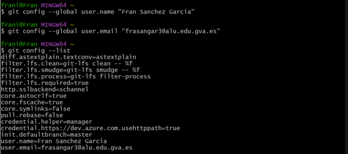
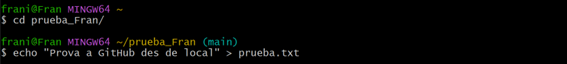
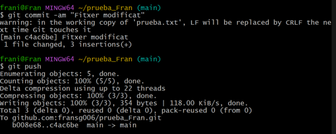
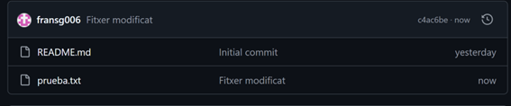
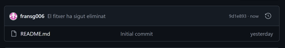
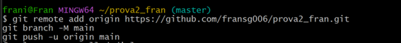

## Pràctica de Git i GitHub

---

#### Crea un compte a GitHub (Si no el tens!!!). 
#### La forma d’accedir als repositoris remots de GitHub serà per SSH, per tant has de copiar la teua clau pública RSA a GitHub, per això:

  *Copia el contingut del teu fitxer ~/.ssh/id_rsa.pub, per això: afegeix una nova clau SSH a l’apartat “SSH keys” del teu perfil a GitHub i enganxa el contingut de la teua clau pública.*

**No disposava d’ell, l’he creat al següent pas**

  *Si no teniu aquest fitxer, podeu generar una nova clau ssh pública seguint les instruccions de l’article Treballant amb claus ssh.*

  *Un cop finalitzat aquest exercici, hauràs de repetir-ho fent ús de tokens.*

**Després copiem la clau pública per a posteriorment apegar-la a GitHub**

**En aquesta pagina de GitHub anem a apegar la clau pública, anant on fica New SSH Key**

**Una vegada fet açò, ja tenim una clau d’autenticació a GitHub**

**Per a provar que hi ha connexió, amb la següent comanda hem pogut veure l’últim missatge el qual es bon senyal ja que si que ens diu que hi ha autenticació**

#### Crea a GitHub un repositori amb el nom prova_el_teu_nom (inicialitza el repositori amb un fitxer README) i la descripció Repositorio de prueba 2ASIX.

##### Instal·la git en el teu ordinador (si no el tens instalat!!!).
   

#### Configuració de git.
*El primer que hauries de fer quan instal·les Git és establir el teu nom d’usuari i adreça de correu electrònic (Assegura’t que les dades són correctes i que has posat el teu nom complet).*
*Això és important perquè les confirmacions de canvis (commits) a Git utilitzen aquesta informació, i és introduïda de manera immutable en els commits que envieu:*

**Per a fer la configuració de git per comandes vaig a fer-ho de la seguent manera:**

**Per últim, per a sols comprovar que s’ha desat correctament el nom i el correu que hem introduït, ho fem amb les següents comandes:**

**Per últim vaig a copiar la URL SSH del repositori per a després clonar-lo de forma local al meu ordinador**

**Ara vaig a crear un document de proba**

**Com ja està fet vaig a preparar-lo per a pujar-lo a GitHub**

**Com ja està pujat, vaig a comprovar-ho a GitHub, com es veu a la següent imatge:**

**Per a modificar-lo, una vagada he acabat, per a tornar-lo a pujar editat ho faig amb la següent comanda:**

**Seguidament per a canviar-li el nom:**

**Per a eliminar el fitxer, ho faig de la següent manera:**

**I per últim per a comprovar el seu estat, es fa us de la següent comanda:**

#### Busca informació per a crear un nou repositori anomenat prova2_el_teu_nom. En aquesta ocasió, crea primer el repositori local (usant git init) i després cerca informació per sincronitzar-lo i crear el repositori remot a GitHub.

**Primer que res, per a crear-lo a Git i després pujar-lo a GitHub s’ha de crear un directori i després dins d’ell fer un git init**

**Ara mateix el repositori està creat però falta crear documents que crearem seguidament per a poder fer un commit. Primer faré el README.md.**

**Després des de GitHub he d’anar a New Repository, i simplement ficant el nom que havíem creat abans ja estaria.**
**Una vegada fet, ens apareix el següent per a connectar-lo al respositori local.**

**Eixos comandaments son els que he d’emprar per tal de que els respositoris estiguen connectats.**
**Copiant i pegant els comandaments anteriors a Git ja ho fa automàticament.**

