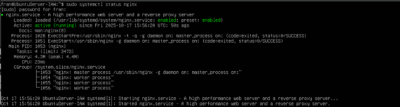
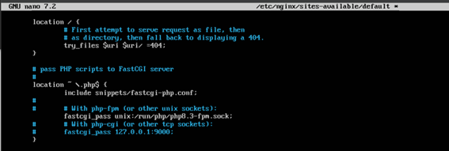
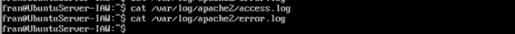

## Practica d'instal·lació d'un servidor LEMP

*Instal·lació del servidor de base de dades*
Primer instal·larem MariaDB, executarem la configuració inicial, i crearem una base de dades nova amb un usuari nou.

Per a accedir dins de MariaDB i poder crear la base de dades i crear l’usuari, ho farem amb la següent comanda
Ficarem també la contrasenya creada en el procés de la configuració inicial.

*Instal·lació de Nginx i PHP*
Amb este comandament instal·lem els dos servicis.

*Verificació del funcionament de nginx*
Al server, el servici apareix actiu.
 

Fins ací, apareix la pagina per defecte d’apache cuan accedim pel navegador amb l’adreça IP del servidor.

El següent fitxer que apareix en rosa, es el que hem de ficar al fitxer de configuració default.
 

 
Després de fer esta configuració amb la vista del fitxer en rosa de la captura superior.

També, al directori /var/www/html, pasem a crear el fitxer info.php amb el text de la linea que apareix:
 

*Verificació del funcionament de PHP*
Es pot veure que al servidor el servici apareix com a actiu.

Al navegador de la maquina amfitriona es pot veure el PHP.	
 

*Accés amb nom (resolució de noms)*

A Windows, la maquina amfitriona, ens situem a C:\Windows\System32\drivers\etc\hosts, i afegim la IP del servidor i el nom que volem que faça la resolució de noms, es a dir, en lloc de ficar l’adreça IP del servidor, ficaríem eixe nom com es veu en la captura d’avall.

*Revisió de registres (logs)*

