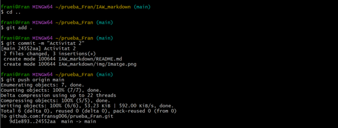
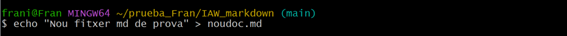

## Pràctica d'introducció a MarkDown

---

**Crea una carpeta en un repositori local (creat en l’exercici anterior) que s’anomene IAW_markdown, que incloga un fitxer README.md.**

**Afegeix contingut al fitxer README.md utilitzant tots els elements de la sintaxi de Markdown que hem recordat.**

**Entre altres inclou:**

>  *Una imatge al document que siga un enllaç a una URL externa.*
  

 > *Crea un directori anomenat img al repositori i afegeix una imatge.*
  

>  *Incorpora la imatge que has afegit dins del document.*
  

**Crea un nou document markdown al repositori.**
   

**Crea un enllaç des del fitxer README.md al nou document que acabes de crear.**
   

**Generar un document .pdf a partir del fitxer README.md.**
   

