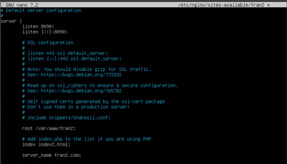

# Pràctica servir múltiples dominis

## Un dels llocs servirà una Pàgina web estàtica (amb contingut HTML + CSS)
**Per a crear primer un lloc, copiaré el fitxer de configuració default, amb nom fran1, de la següent manera:**

**El HTML ha d’estar en un directori per al lloc web, creat a /var/www/**

**Una vegada creat el directori, l’apegue dins d’ell.**

**Cuan ja el tinc copiat, podem treballar sobre el fitxer fran1 en /etc/nginx/sites-available per a la pagina web 1. Els canvis realitzats al fitxer son els que es veuen a la següent imatge.**

*He canviat el port del 80 al 8089, el lloc del HTML, en quins fitxers mirar per a la web i el nom del servidor.*

**Ara per a activar el lloc web fem el següent comandament:**

**Ara amb la següent adreça, al navegador de la maquina amfitriona, es pot accedir a la web: http://172.20.10.2:8089**

## L’altre lloc servirà altra Pàgina web estàtica (amb contingut HTML + CSS + Javascript)
**Per al fitxer de configuració, he copiat el fitxer copiat de configuració del punt anterior**

**També, a /var/www/ he creat el directori fran2, on he ficat el HTML index2.html**

 
**He fet els següents canvis a la configuració de fran2 a /etc/nginx/sites-available/fran2:**

 
*He canviat el port del 80 al 8090, el lloc del HTML, en quins fitxers mirar per a la web i el nom del servidor.*

**I per últim he d’habilitar el lloc web, amb la seua respectiva comprovació al navegador de la maquina amfitriona. Per a accedir a la web es fa de la mateixa manera però canviant sols el port: http://172.20.10.2:8090**

