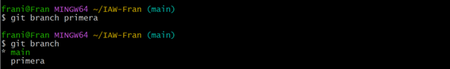

## Pràctica branques i unions

---

**Crea una branca que s’anomene primera al teu repositori local, i executa la instrucció necessària per comprovar que s’ha creat.**
   

**Crea un nou fitxer en aquesta branca i fusiona’l amb la principal. S’ha produït un conflicte? Raona la resposta.**
   

No hi ha cap conflicte ja que sols ha hi hagut modificacions en varios llocs alhora

**Esborra la primera branca**
   

**Crea una branca que s’anomene segona, i modifica un fitxer per produir un conflicte en unir-lo a la branca principal. Lliura el fitxer on s’ha produït el conflicte.**
   

> **Soluciona el conflicte que has creat al punt anterior i sincronitza la branca segona al remot.* *  

No ha hi hagut cap conflicte.