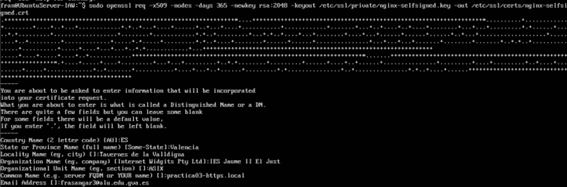
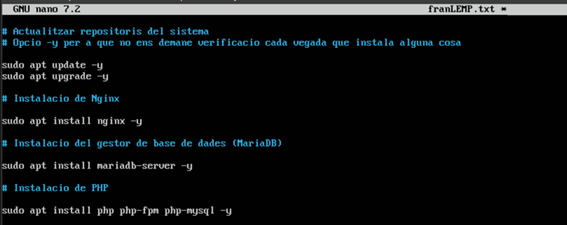
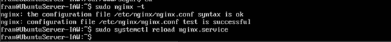

## Pràctica certificat SSL/TLS

**Primer he creat el certificat manualment**

**Per a consultar el ceritifcat i la data de caducitat:**

 
*Utilitzar la resolució estàtica, modificant el fitxer /etc/hosts de l’ordinador des del qual accedirem a la pàgina i poder accedir-hi mitjançant nom de domini.*

#### Script per a automatitzar la instal·lació
*Automatitzar la instal·lació d’una pila LEMP (instal·la cada element per separat)*

#### Script per a automatitzar la creació d'un certificat autosignat

*Automatitzar la creació i configuració d’un certificat auto signat SSL/TLS amb openssl per al servidor web Nginx.*

#### Configurar un altre lloc segur

**Per a configurar el lloc segur, ho farem al seguent fitxer de la seguent manera al directori /etc/nginx/sites-available/**

**Després al directori /var/www/ anem a crear el directori segur amb un index.html amb la següent estructura html:**

**Comprovem que la sintaxis es correcta.**

**Veiem que el fitxer segur no es troba a sites-enabled, per tant, el lloc no podria funcionar sense habilitar-lo abans.**

#### Accés
*Comprovar que s’hi pot accedir, tant per http com per https des d’un navegador web.*
**Ens ix l’avis de seguretat abans d’accedir.**

**I si accedim ja ens apareix el contingut**

**Tant amb la IP com amb el nom**

**Podem veure el certificat que havíem creat**

#### Redirecció
*Redirigir http a https.*
**Per a redirigir l’http a https, ho fem de la seguent manera al lloc segur, afegint les següents línies.**

*Comprovar el bon funcionament de la redirecció.*
Cuan fique http://intranet.local, automàticament m’envia a https://intranet.local 

