## Pràctica d'administració de WordPress

---

**Passos realitzats:**

---

#### Tema

~~~
En Aperiencia-Temas
~~~

* **Busca un tema gratuït de WordPress, instal·la’l i configura’l adequadament.**
  
El primer que he fet, ha sigut descarregar un tema d'internet, en format zip com es veu en la imatge de baix.

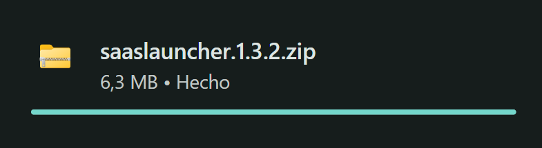

Ara a WordPress, on es troben els temes, anem a *Pujar tema* i sel·leccionem el .zip.

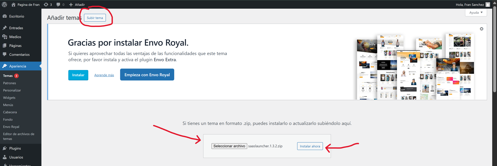

En cas d'error a l'hora de pujar el .zip, que es l'error de la seguent imatge, fer el seguent pas.

S'ha d'anar al seguent fitxer per tal de augmentar la mida dels fitxers.

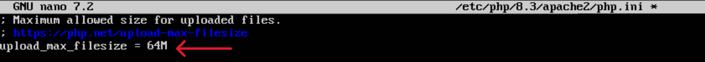

Una vegada ja s'ha pogut pujar, podem veure com funciona automaticament.
A la mateixa imatge, podem veure l'opció d'activar-lo també.

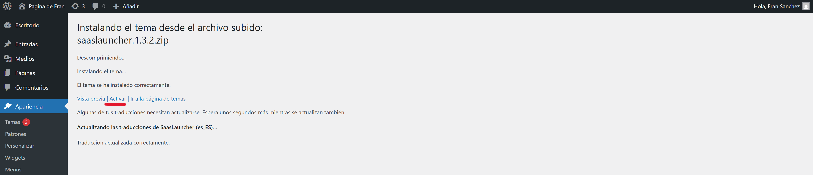

Per ara es veu d'aquesta manera amb les dades del tema per defecte.

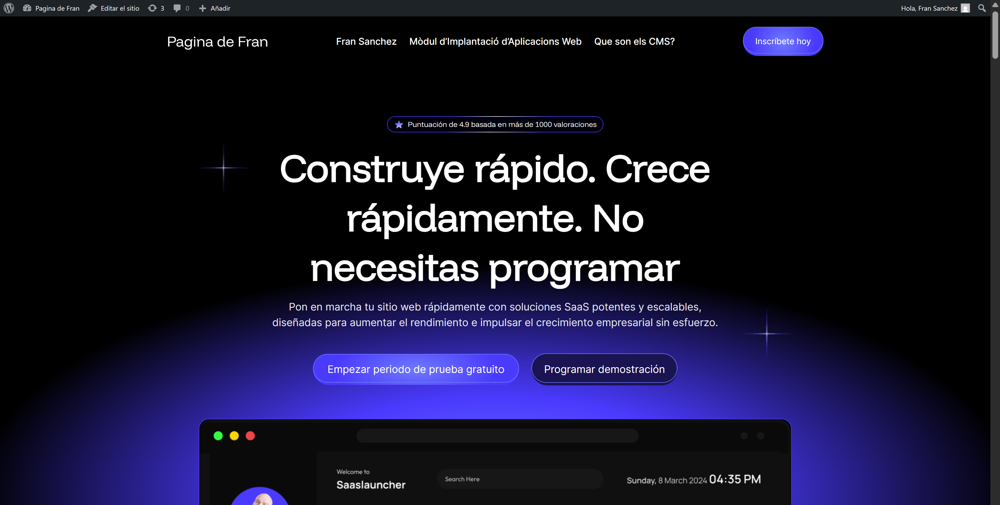

He fet aquestos canvis per a que tinga una visió amb les meues dades.

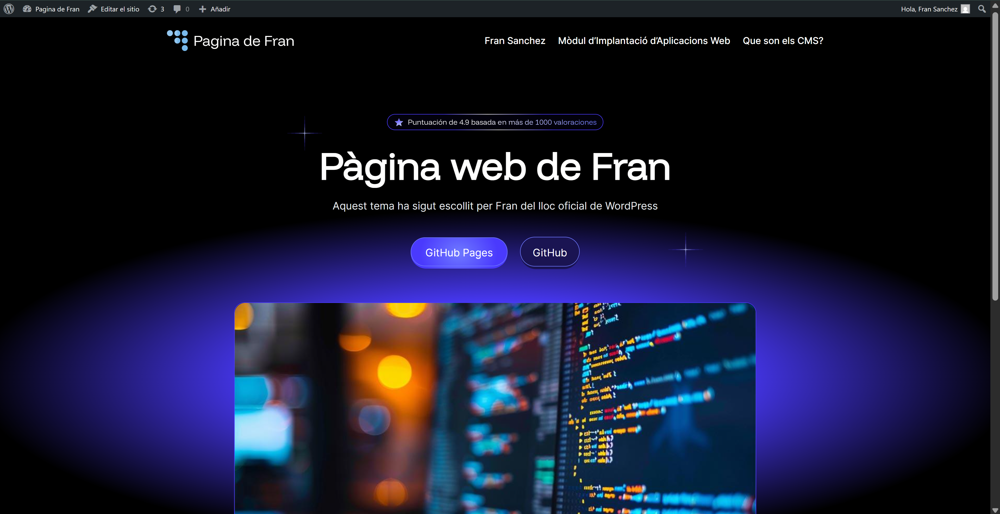

---

#### Usuaris

~~~
En Usuarios
~~~

* **Crea un usuari per a cadascun dels rols d’usuari que disposa WordPress.**

En la seguent imatge es pot observar un usuari amb cada rol disponible a WordPress, i baix d'ella, que pot fer cadascun dels rols.

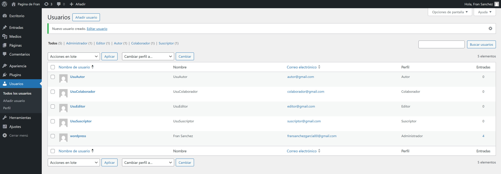

> **Administrador:** Control total sobre el lloc, pot gestionar-ho tot: contingut, plugins, temes, usuaris, configuracions.

> **Editor:** Gestiona tot el contingut (publicar, editar, eliminar) de qualsevol autor, però no plugins ni temes.

> **Autor:** Escriu, edita i publica les seves pròpies entrades i pot pujar fitxers multimèdia.

> **Col·laborador:** Escriu les pròpies entrades però no les pot publicar; necessita un Editor o Administrador per revisar-les i publicar-les.

> **Subscriptor:** Només podeu llegir contingut i gestionar el vostre perfil (no podeu escriure ni editar res).

* **Inicia sessió amb cada usuari creat i gestiona diferents tipus de continguts comprovant quines operacions poden fer atenent al seu perfil ( crear, modificar, esborrar contingut seu i/o d’altres usuaris, fer altres operacions?)**

+++ *Logejat com a Suscriptor*: Es pot veure que sols mostra les opcions de perfil i escriptori, i no permet editar res del lloc web.

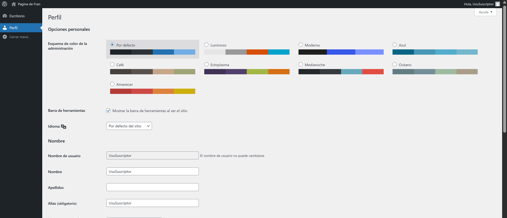

+++ *Logejat com a Autor*: Es pot veure que mostra més opcions que amb un usuari suscriptor, i que per tant, com s'anomena a les definicions de dalt, es pot afegir entrades noves, pero no editar les ja existents.

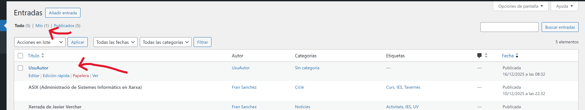

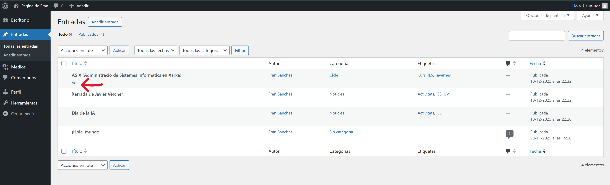

+++ *Logejat com a Col·laborador*: Es pot veure les opcions que es veuen a la barra lateral esquerra, i que sols permet veure el contingut d'entrades ja creat.

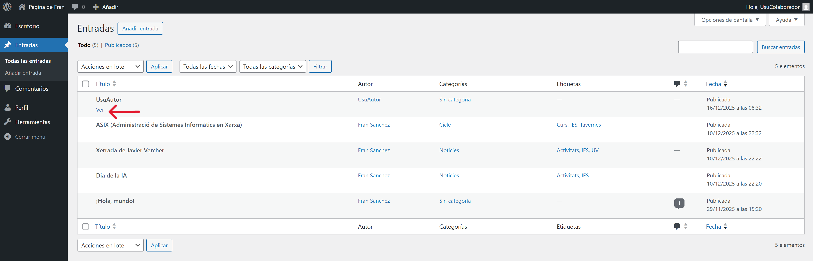

A la comprobació de crear una entrada amb dit usuari, es pot veure que s'ha d'enviar a revisió, per a que ho accepte un usuari autoritzar a pujar entrades al lloc web:

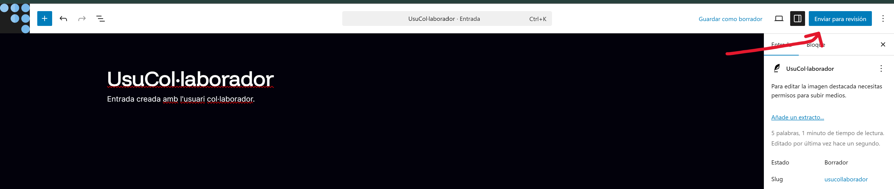

Una vegada enviada a revisió es veu, com a pendent, fins que s'accepte.

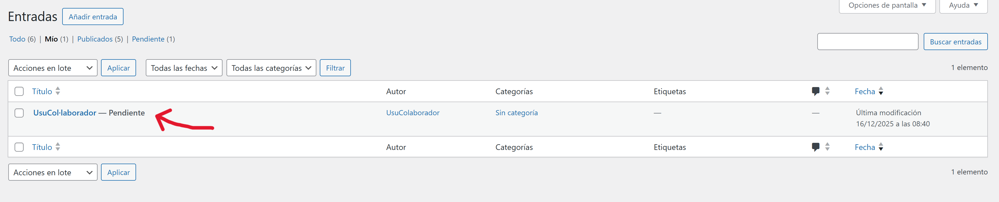

Aleshores, amb aquest usuari es pot afegir contingut nou, pero no editar ni modificar el contingut ja existent d'altres usuaris.

+++ *Logejat com a Editor*: Es pot veure que mostra practicament totes les opcions disponibles com a un administrador, pero sense les opcions de plugins i temes, així d'eixa forma, no es poden instalar plugins ni temes nous, ja que sols es te permis d'editar el contingut del lloc.

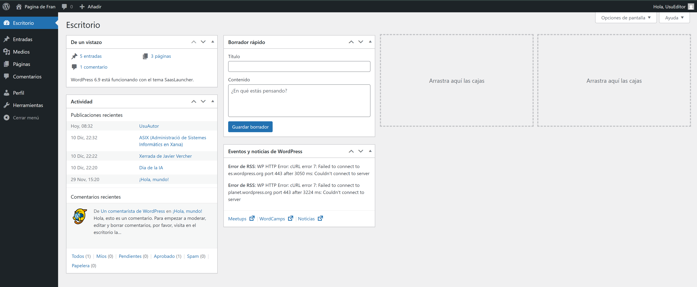

Per a la prova amb aquest usuari, vaig a crear una pagina nova, com es veu a la seguent imatge.

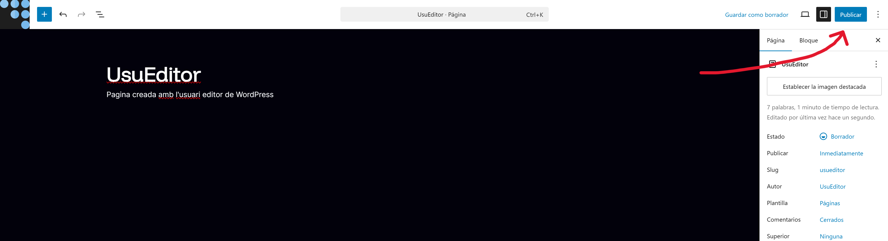

* **Finalitza deixant almenys 3 continguts diferents.**

Ara com usuari administrador, es pot observar l'entrada creada amb l'usuari autor i col·laborador (amb l'acceptació pendent d'aquest) i la pagina nova del usuari editor.

Per a pujar-la, s'ha d'editar i després publicarla des d'un usuari que tinga permisos per a fer aquesta acció, com es d'administrador.

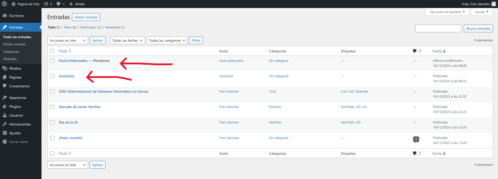

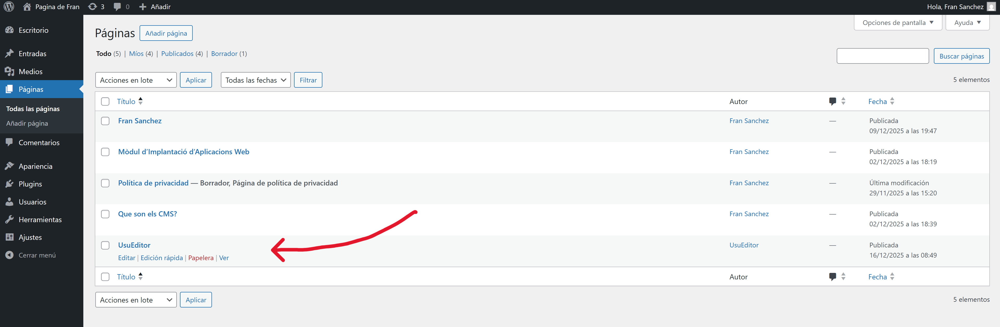

Al lloc web es veu el seguent:

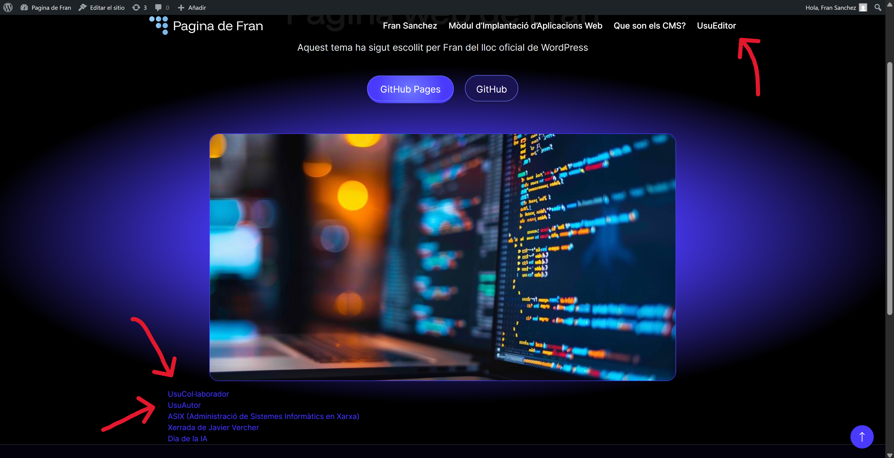

---

#### Menús

~~~
En Apariencia-Editor
~~~

* **Editeu la navegació per el lloc web i modifica’l per incorporar un menú amb diferents opcions a les que es té per defecte.**

Si ens situem on diu el principi del apartat, a Capçalera, es pot modificar el menú superior, i en concret, el menú de navegació de la pàgina.
Es pot veure que ja apareix la pagina de l'usuari editor creada al punt anterior.

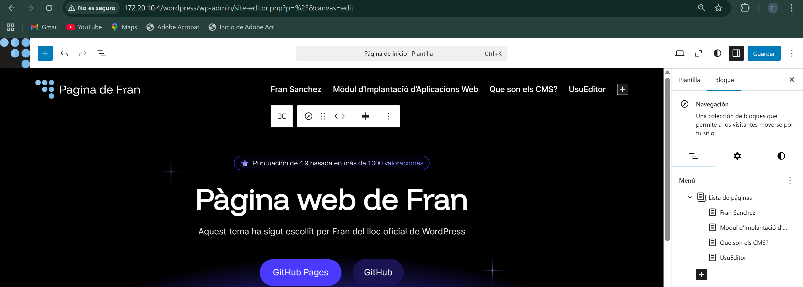

He afegit un botó nou, el cual envia a la web de Wikipedia, que explica que es una aplicació web.

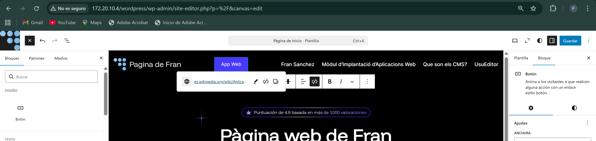

* **El menú ha d’incorporar almenys 2 dels continguts nous generats en l’apartat anterior i 2 enllaços d’internet.**

Es pot veure que apareix la pagina de l'usuari editor creada al punt anterior, junt a 2 botons, un que ens parla d'aplicacions web, i l'altre ens envia al lloc oficial de WordPress, més les pàgines creades en punts/pràctiques anteriors.

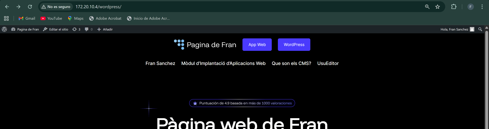

---

#### Plugins

~~~
En Ajustes-Generales
~~~

* Feu un estudi de quins són els plugins i widgets més utilitzats a WordPress i vore quin d’ells podríeu utilitzar al vostre lloc.

He ìnstal·lat el seguent plugin, el cual s'ha d'activar com es veu a la seguent imatge.

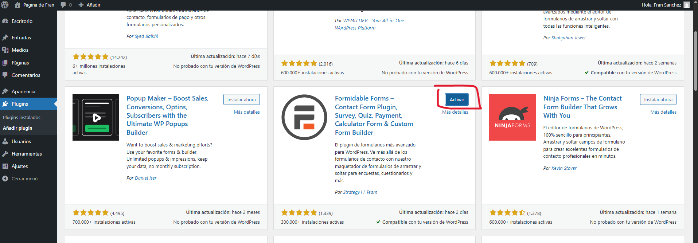

Després, a la barra lateral esquerra, es pot veure el nou apartat d'aquest plugin, on anem a crear un formulari.

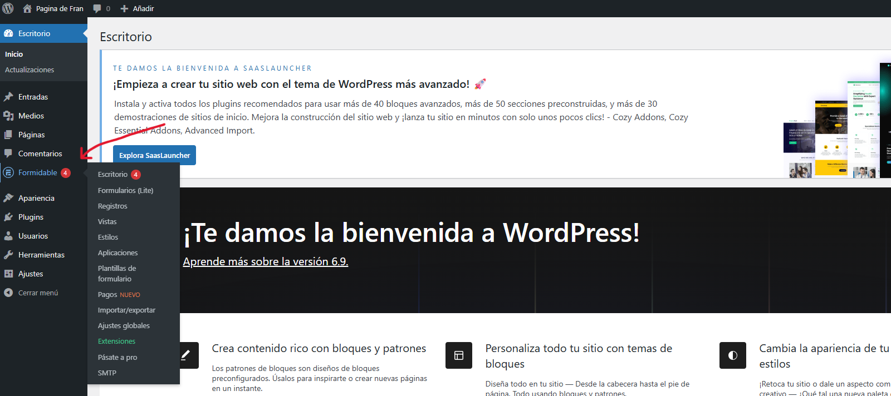

Des d'aquest menú dins de formularis, es pot crear un formulari.
En la seguent imatge es pot veure els camps disponibles per a ficar al formulari a la barra lateral esquerra, i a la barra superior es pot veure les diferents configuracions per al formulari.

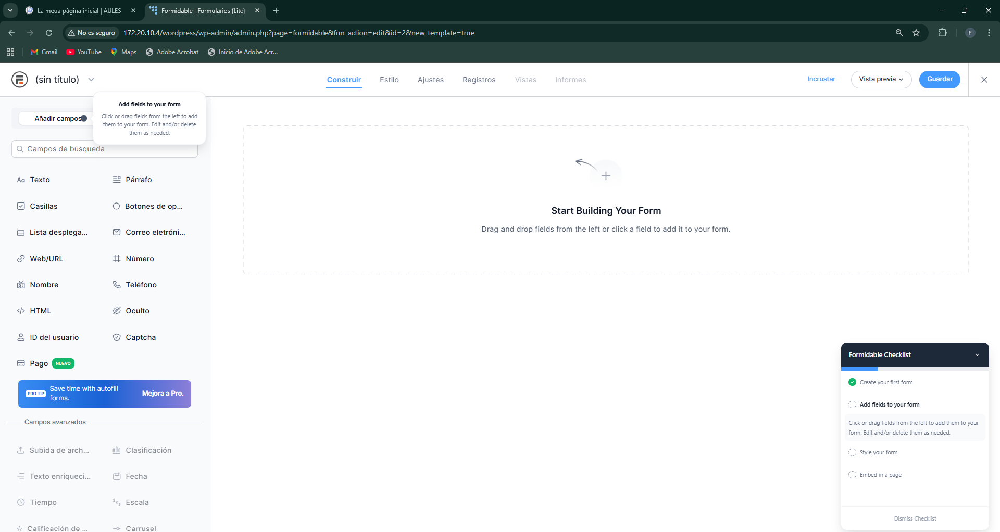

Jo he creat aquest formulari i després li he fet modificacions com estils o altres.

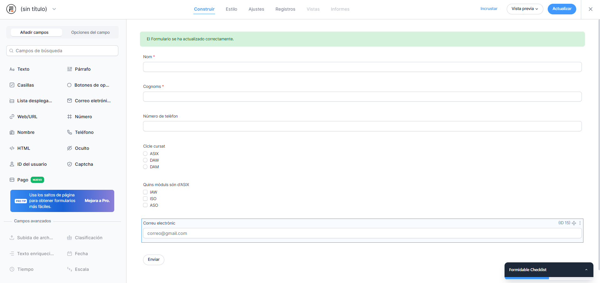

Per a incorporar-lo a la pagina principal, es pot fer clicant al botó *Incrustar*.

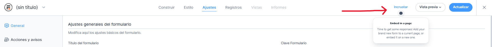

En aquest cas l'he inscrustat a la pagina creada del mòdul d'IAW.

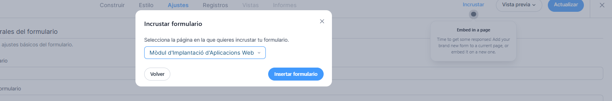

A la pagina d'IAW, després d'incorporar-lo, ja es pot veure d'aquesta manera.

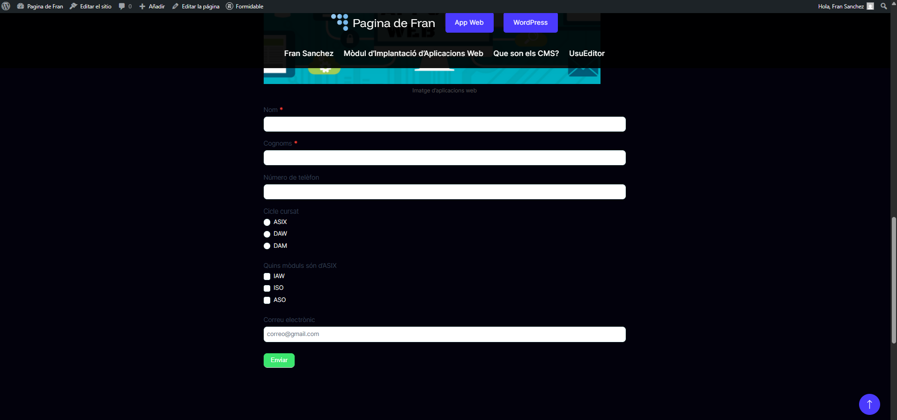

Ara he instalat el segon plugin, en aquest cas este, per a crear taules en els llocs.

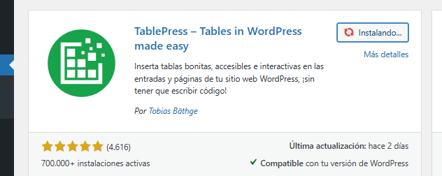

Una vegada activat, ja podem veure'l al menú, i començem a omplir les dades per a crear la taula.

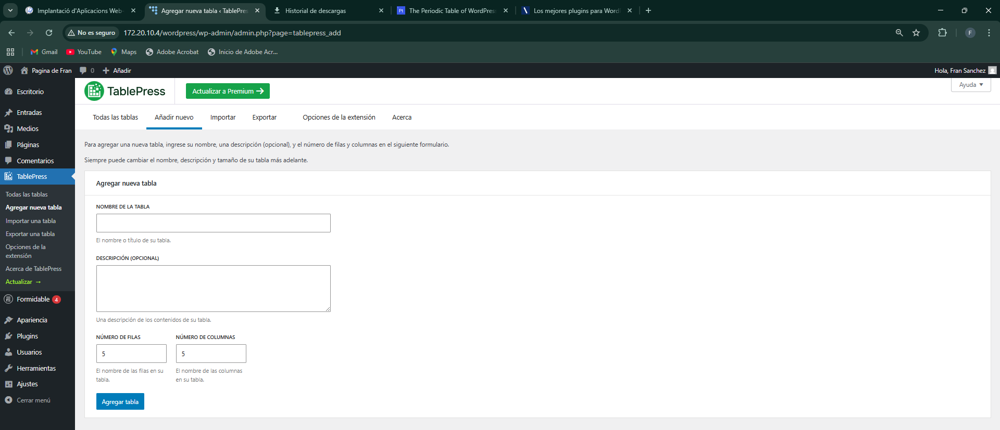

He creat aquesta taula amb estes dades.

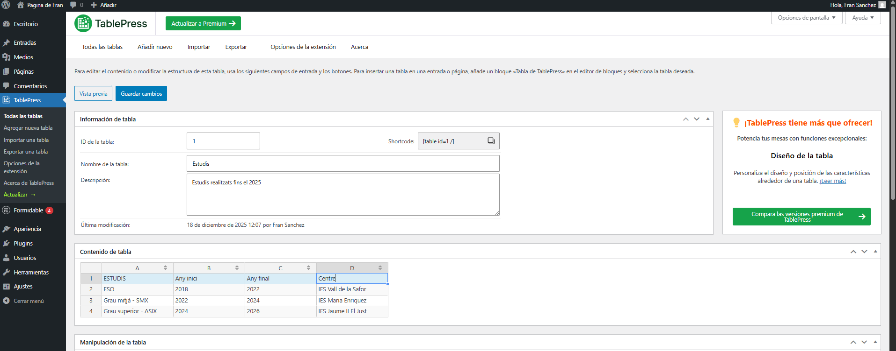

Després per a mostrar-la al lloc web, des de dins de la pagina o entrada on volem inserir-la, fiquem un bloc de TablePress i fiquem la taula.

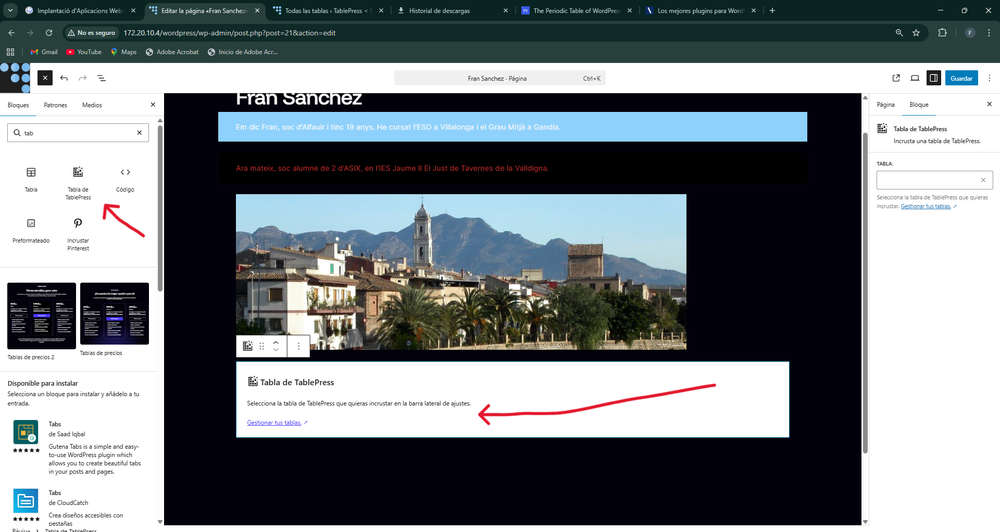

Hem d'escollir un codi abreviat que ix a la taula, com es veu a la seguent imatge per a poder insertar-la.

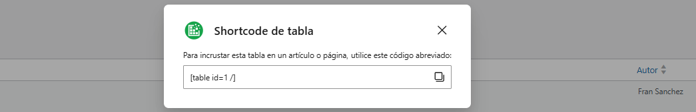

Després ja la podem veure al lloc inserida mitjançant el codi anterior, copiant i pegant dit codi sobre el bloc de TablePress.

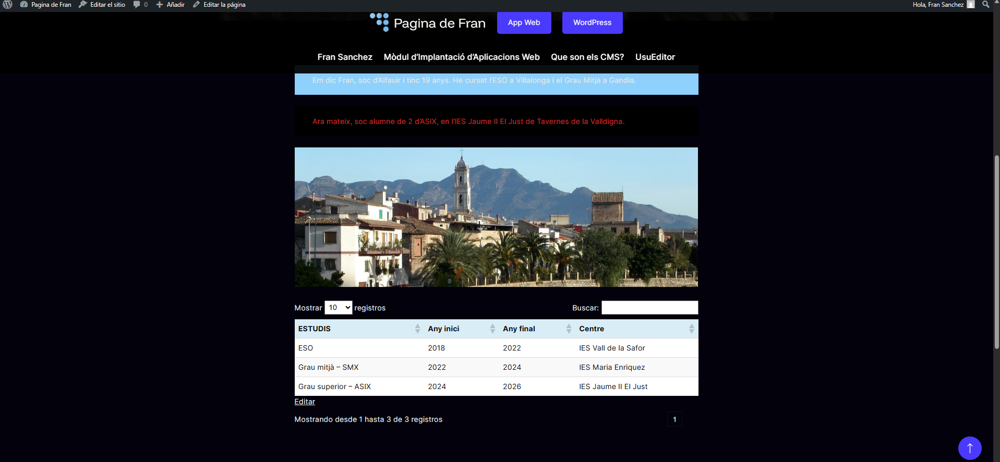

