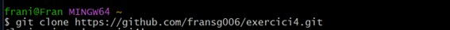
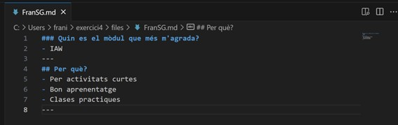
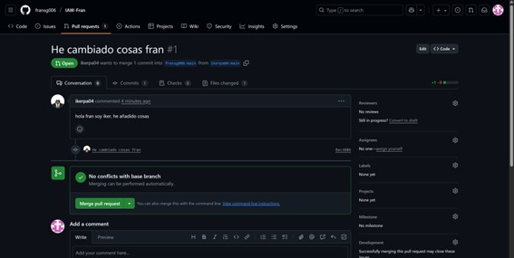

## Pràctica Pull Request

---

#### Documentació dels passos fonamentals (amb instruccions) per fer el pull request.
#### En finalitzar l’exercici (quan tots els alumnes hagen enviat el PR i el professor ho recorde) has d’actualitzar el teu repositori remot i enviar-me la URL per poder comprovar-ho.
---
#### Que s’ha de fer:

*• Realitza primer un pull request al repositori per sol·licitar dos canvis.*

*• Has de canviar el fitxer README.md per afegir un enllaç a la llista, on pose les teues inicials i vaja al fitxer que crearàs en el directori files.*

*• Crea un fitxer al directori files, que s’anomene les_teus_inicials.md (en el meu cas s’anomenaria emm.md) i on escrigues a markdown la resposta a la pregunta: Quin mòdul t’agrada més? I per què? (cal utilitzar almenys 5 marques diferents de markdown). Realitza el pull request (amb un missatge de commit significatiu) i espera que sigua acceptat per mi. En acabar l’exercici has de sincronitzar el teu repositori perquè tingues tots els fitxers de tots els teus companys.*

*• Tria un company i fes un Pull Request sobre un repositori seu. El mateix company o un altre ha de fer un Pull Request sobre un repositori teu.*

---

**Primer es fa un fork del repositori al cual vols aplicar canvis.**
**Una vegada tindre el repositori de la professora al teu perfil, s’ha de fer un clone al pc local.**

**Una vegada fet el clone, en situem dins del directori clonat i treballem sobre ell.**
**Dins d’ell es troba el directori files on s’ha de desar una imatge i el README.md on s’ha decrear un enllaç a la imatge amb el teu nom.**

**També el fitxer markdown.**

**Una vegada realitzat ho pujem al repositori amb el add, commit i push.**

**Seguidament fem un contribute amb el repositori de la professora.**

---

#### Pràctica 02: Pull Request. Com col·laborar en un projecte de programari lliure? Lliurar la documentació de les passes fetes i on estiguen les captures:
*Acceptació del PR que ha fet el teu company sobre el teu repositori.*

**He fet el fork al repositori de Iker.**

**Pull request rebut de Iker.**

**L’he acceptat.**

**Ja apareix el document creat per Iker al meu repositori.**

**I el meu document sobre el repositori de Iker.**

*Realització del PR sobre el repositori del professor.*

**Es tracta del PR que he fet sobre el repositori de la professora.**

**Acceptació per part de la professora.**

