## Pràctica de crear un tema a WordPress

---

**Passos realitzats:**

---

#### Crear fitxers i directoris necessaris

Primer s'ha de crear un directori per al tema que vaig a fer amb els fitxers dels seguents punts.
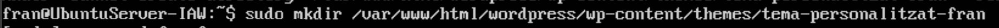

* **Creació del fitxer style.css**
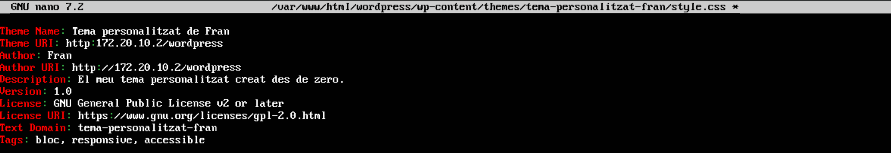

* **Creació del fitxer index.php**
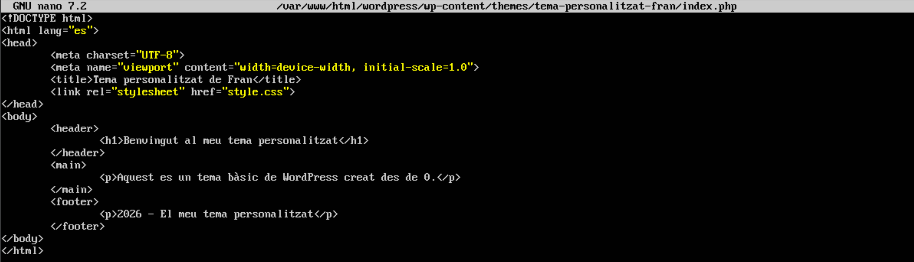

Ara mateix, com que no he modificat ni he ficat cap imatge, el tema es pot veure així tauler de WordPress.

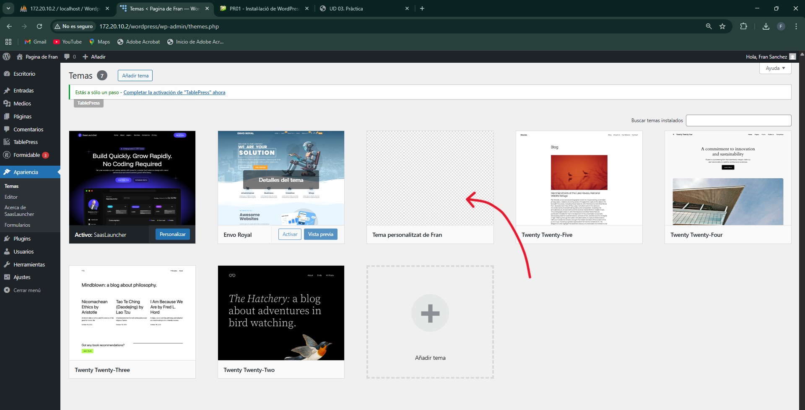

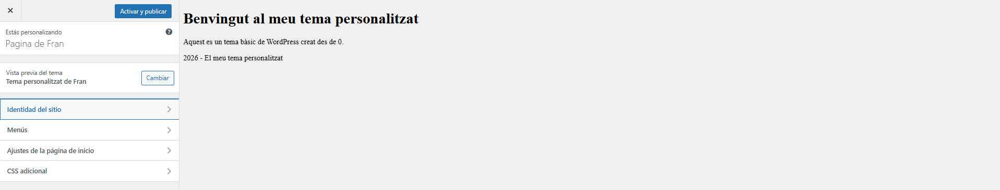

Els canvis es poden apreciar directament al codi del fitxer index.php dels punts superiors, en les seguents imatges.

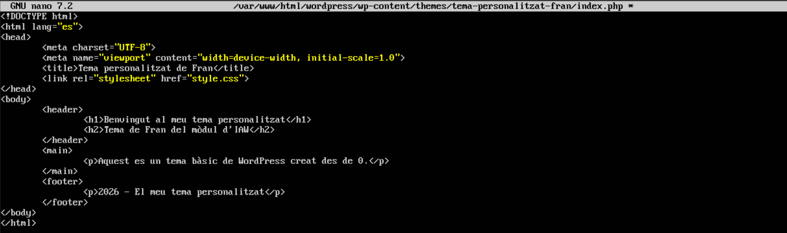

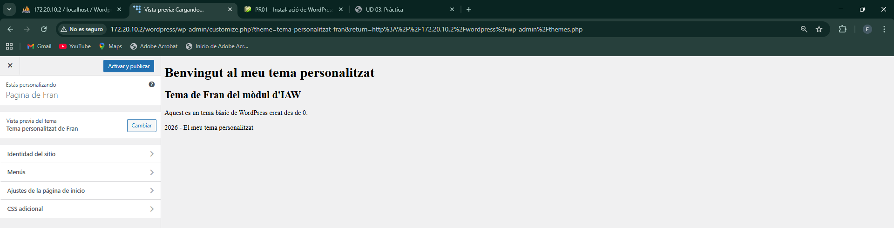

---

#### Activació del tema en WordPress

* **Inicia sessió al panell d'administració de WordPress**
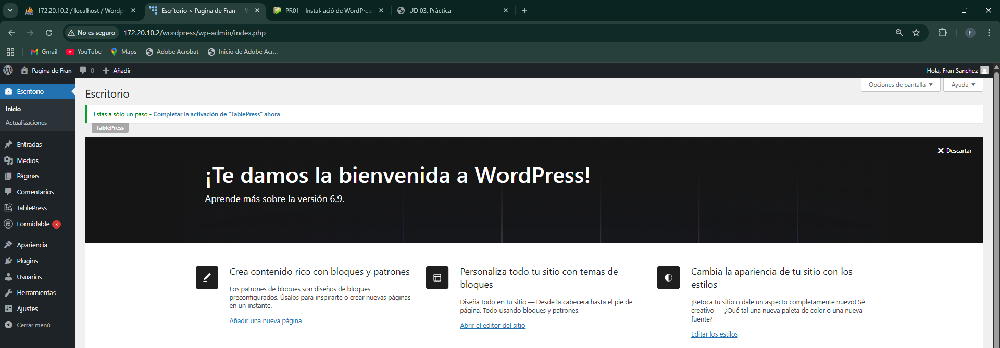

* **Anar a Aparença>Temes, busca el tema creat i activa'l**
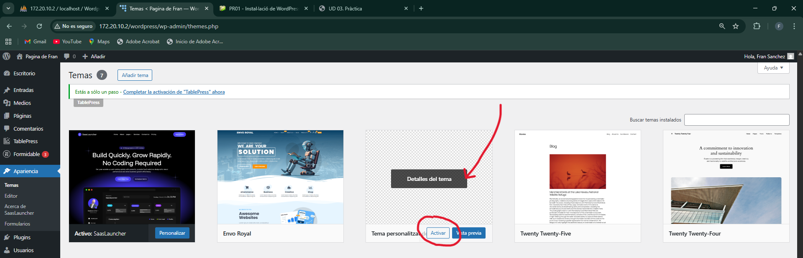

---

#### Millora del tema

* **Un fitxer screenshot.png per a la vista prèvia del tema**

He mogut la imatge al directori del tema personalitzat.

Després de que es trobe la imatge al directori del tema, es pot veure ja ficat com a vista prèvia.

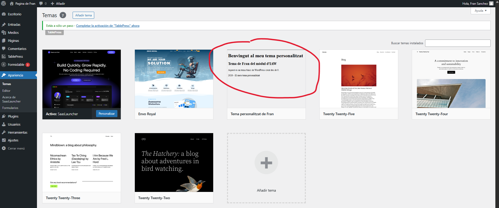

* **Crear un full d'estils addicional per a millorar el disseny (custom.css)**
  
Primer he creat el fitxer custom.css amb el seguent contingut.

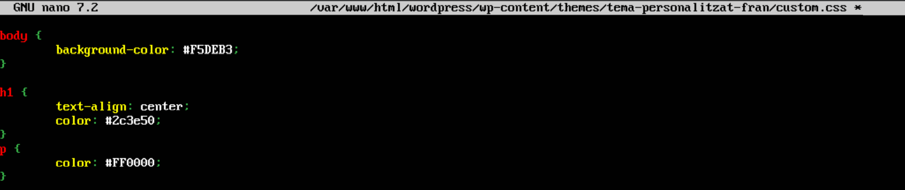

Després, al index.php, he afegit la linea d'enllaç al css.

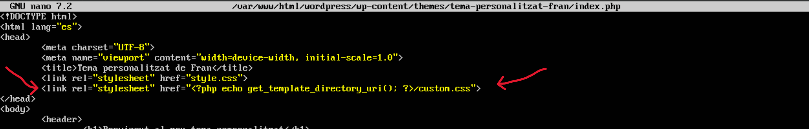

Ara el tema es veu amb el seguent disseny.

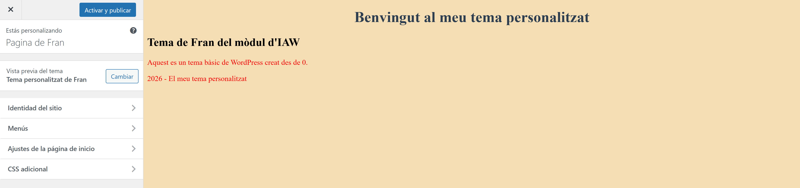

* **Fitxers a la carpeta parts/ per a la capçalera i el peu de pàgina**

Per a afegir un peu i una capçalera, he creat una carpeta parts dins del directori del tema.

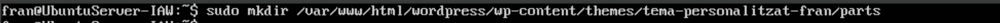

Després, dins he creat 2 fitxer php més, un per al peu, i l'altre per a la capçalera.

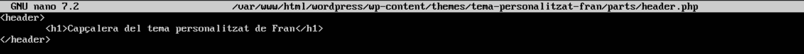
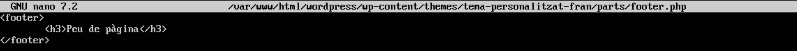

Al fitxer index.php he afegit aquestes dues linies al body, per a que mostre la capçalera i el peu.

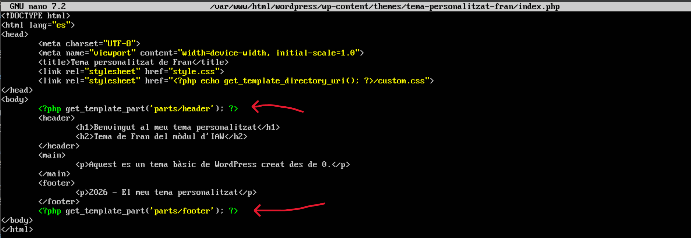

D'aquesta manera es veu així el tema en aquest moment.

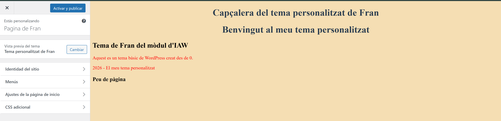

