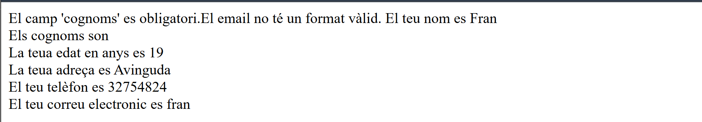
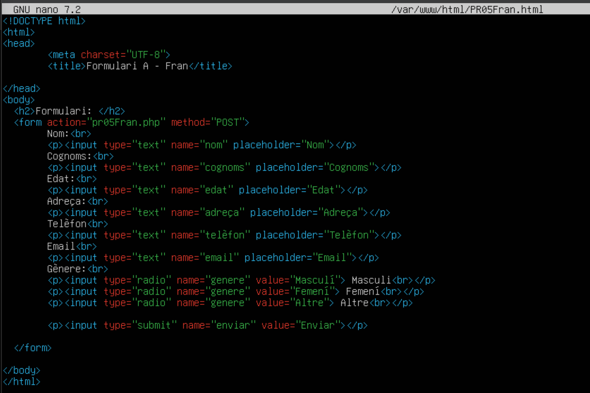
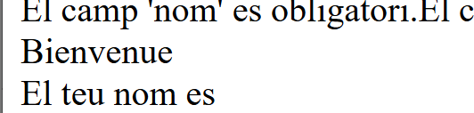
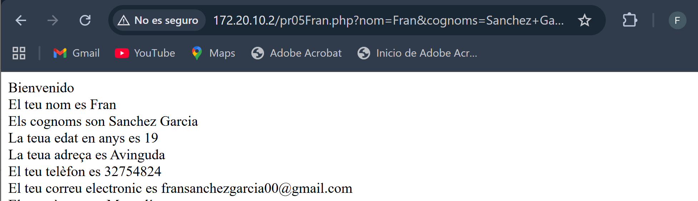

## Pràctica de Formularis

---

### Formulari A
#### Crear un formulari que permeta introduir les dades d’una persona (nom, cognom, edat, adreça, telèfon, correu electrònic) i mostrar-les a la mateixa pàgina una vegada se polse el botó d’enviar. A més, cal validar que els camps no estiguen buits.

Aquest es el formulari:

Amb el seguent HTML i PHP:

 
El funcionament es el següent, i ficarem les dades que es veuen a continuació i el resultat:

 
#### Modificar el formulari perquè es puga seleccionar el gènere de la persona (masculí, femení, altre) i mostrar-lo a la pàgina.
He afegit algunes modificacions més el que demana al enunciat:
Al HTML:

Al PHP:

Es veu de la següent manera:
 

Si fiquem les dades, veiem el resultat (Ens fixem sols en el que hem afegit nou, que es l’elecció de gènere)

> • **Ampliació del formulari per enviar mitjançant POST**

#### Modificar el formulari perquè s’envie la informació mitjançant el mètode POST a una altra pàgina anomenada processar.php. En aquesta pàgina, mostrar les dades ingressades al formulari, igual que anteriorment i les seues modificacions.

Les modificacions canvien, i es veuen al PHP, canviant la URL de .html al .php que tenim configurat.

#### Modificar el formulari perquè es puga seleccionar els idiomes que parla la persona (espanyol, anglès, francès, alemany, italià) i mostrar-los a la pàgina. En donar-li al botó d’enviar, cal mostrar un missatge de benvinguda en aquest idioma. Pot haver-hi diversos idiomes, i si no heu seleccionat cap, mostrar un missatge que indique que no s’ha seleccionat cap idioma.

Al HTML he afegit estes línies d’idioma per a que es compleixca l’enunciat:

Al PHP he afegit les següents línies d’idioma:
 

Al formulari s’observa el seguent, he escollit Francés per exemple:

I al enviar el formulari el seguent:
 
 

> • **Enviament mitjançant GET**

#### Prova el formulari amb diferents dades i canvia el mètode d’enviament de POST a GET. 

He fet estos canvis al HTML (canviar el mètode de POST a GET):

He fet estos canvis al PHP:

 
He ficat estes dades al formulari:

I els canvis s’observen a la pròpia URL:

#### Quines diferències observes?
Que els missatges que escrius es mostren directament a la URL
 
### Formulari B
Crea un formulari que permeta enviar un fitxer de text. El fitxer ha de ser guardat al servidor i mostrar un missatge indicant que s’ha guardat correctament. A més, caldrà mostrar el contingut del fitxer a la pàgina.
