## Pràctica de modificar un tema a existent

---

**Passos realitzats:**

---

#### Part 1 - Modifica el tema existent
* **Selecciona un tema i activa'l.**

El tema que he escollit es el seguent.

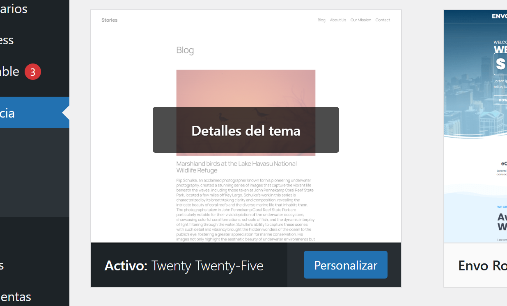

I es veu d'aquesta manera aplicat ara mateix.

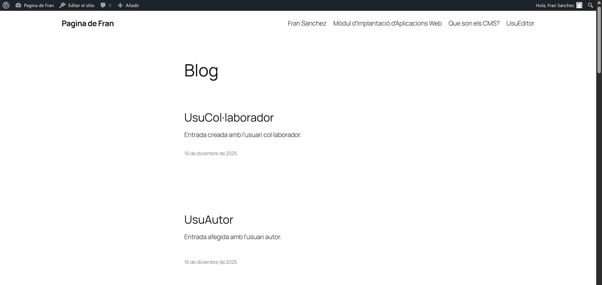

* **Modificar el fitxer style.css del tema activat**

Per a que canvie el lloc web, he fet estes modificacions al CSS anomenat, a *Herramientas>Editor de temas*.

En aquest cas he afegit una capçalera amb un text baix al fitxer header.html.

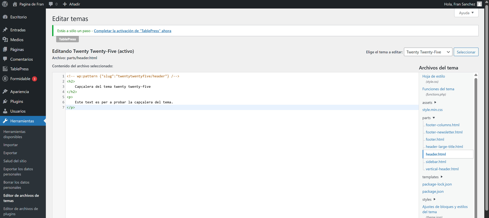

Amb aquesta capçalera, es pot veure així:

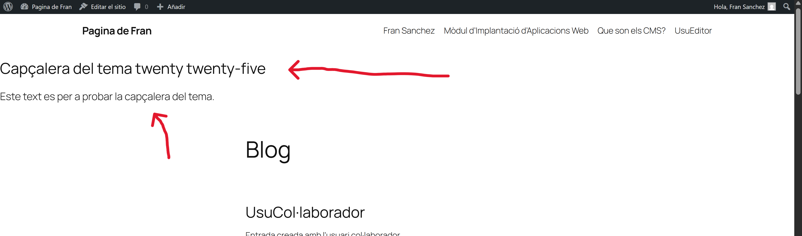

El tema per defecte, estaba agafant el fitxer d'estils **style.min.css**, per lo que al fitxer de functions.php he fet el seguent canvi, per tal de que agafe el fitxer **style.css**.

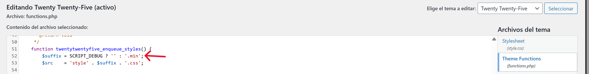

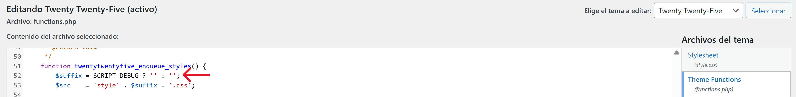

Ara, si afegim algo al fitxer **style.css**, com es veu a la seguent imatge, ja es veu reflexat al lloc web amb el tema aplicat.

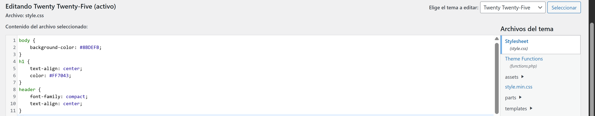

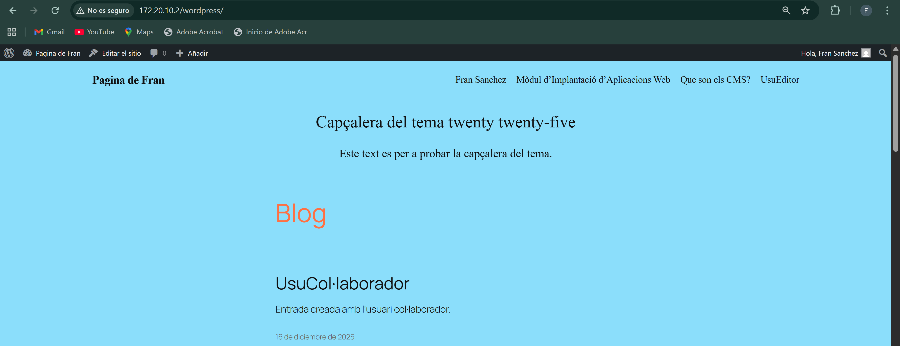

---

#### Part 2 - Personalitzar el fitxer theme.json

* **Ubica i edita el fitxer json**

**Afegeix una nova paleta de colors personalitzada dins del bloc "settings"**

El fitxer theme.json es troba dins del directori del tema sel·leccionat, a la ruta que es veu a la seguent imatge, amb els canvis que es veuen a continuació.

L'ubicació del fitxer json demanat es la seguent amb el contingut que es mostra en pantalla.

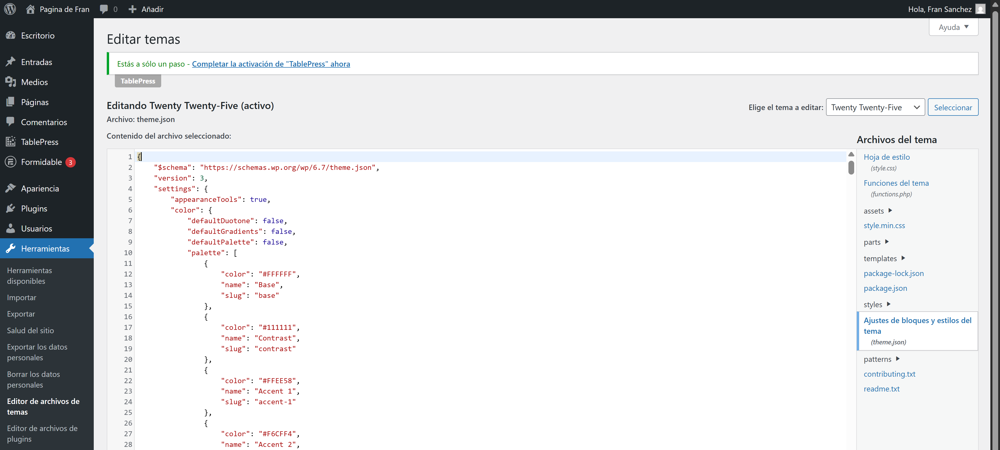

Ara mateix, les paletes de colors per defecte son les seguents al editor.
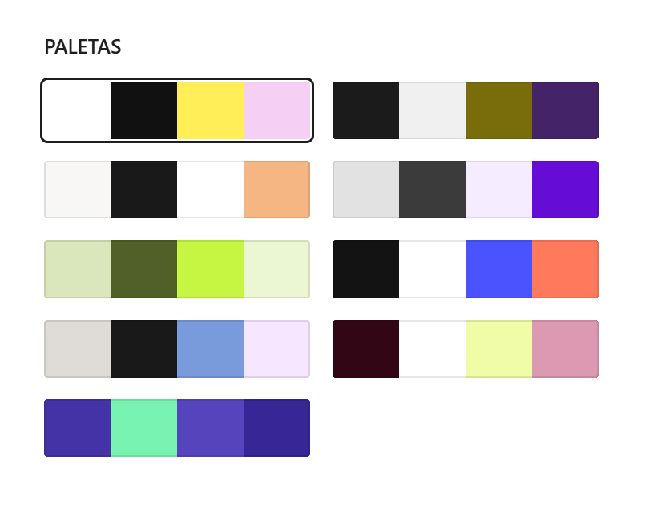

Per a afegir una nova paleta de colors, he creat un fitxer nou amb format json, junt als altres fitxers que conformen 8 de les 9 paletes de la imatge anterior, anomenat **fran.json**, amb el seguent contingut i permisos.

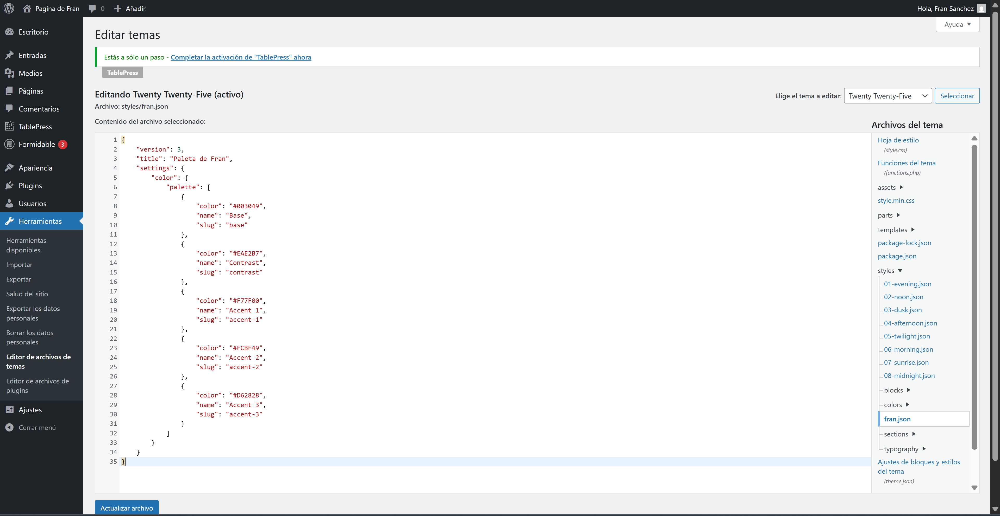

Ara mateix podem observar al Editor que apareix la nova paleta de colors, i amb eixa hi han 10:

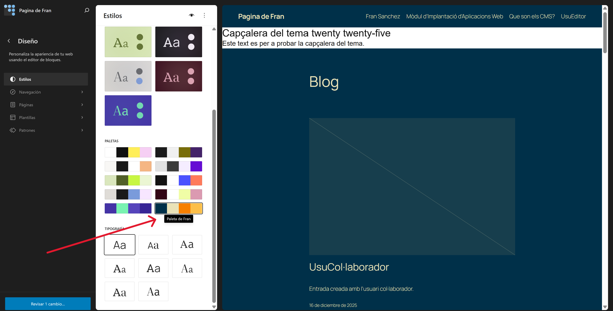

---

#### Part 3 - Crear un tema fill amb Create Block Theme

* **Instal·lar i activar el plugin Create Block Theme**

Ara instal·laré el plugin al apartat de plugins com es veu a l'imatge.

Ara mateix, ja es troba instal·lat i activat.

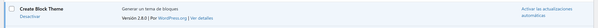

* **Crear un tema fill**

Per a crear ara un tema fill, del que tenim aplicat actualment, en Aparença apareix un nou apartat del plugin que acabem d'instal·lar.

Aleshores, anirem a l'opció que es troba marcada a la seguent imatge per tal de crear un tema fill.

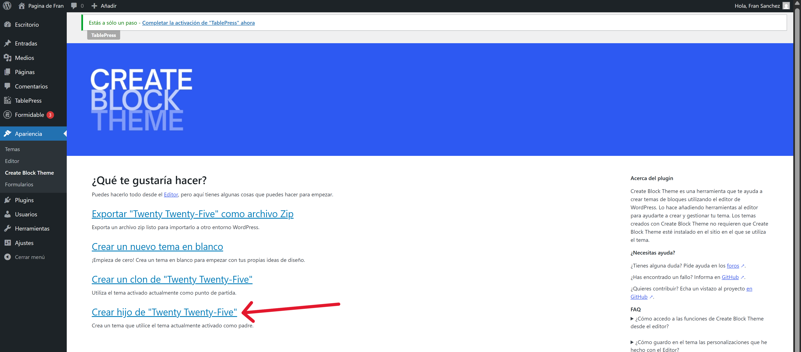

Ficarem les dades com el nom.

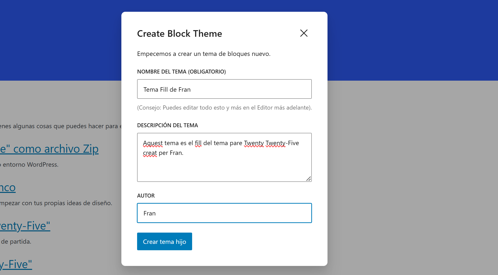

Una vegada creem el tema ens ix el seguent missatge al navegador.

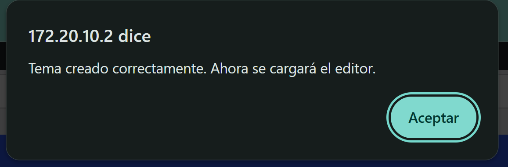

I al apartat temes veiem que ja s'ha aplicat el tema i apareix al llistat.

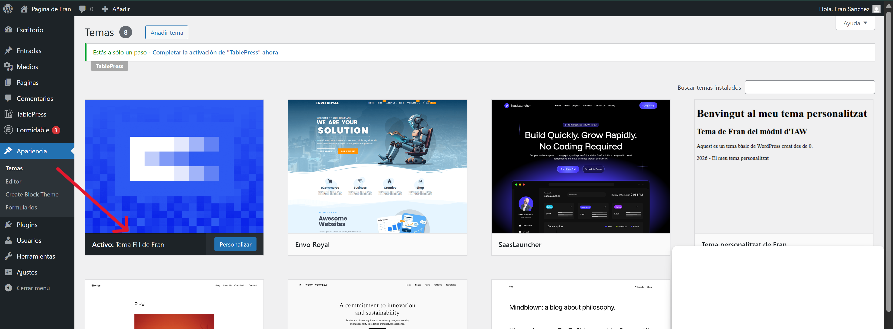

I persupost, al directori on es desen els temes, apareix el directori del tema fill.

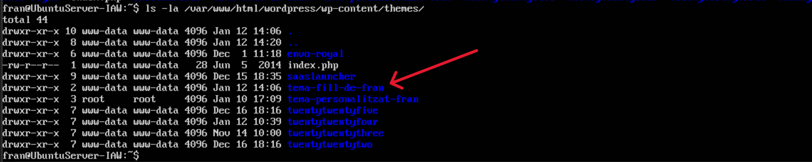
