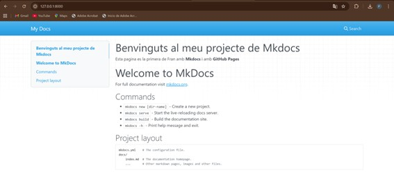
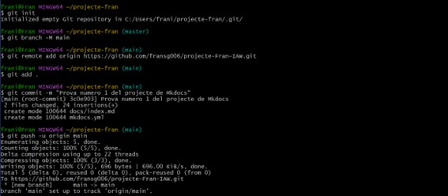
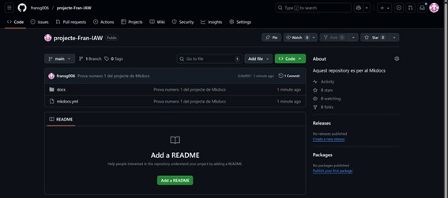
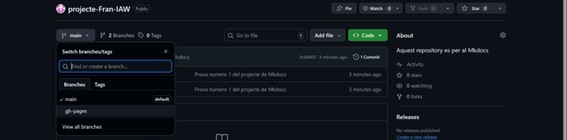

## Pràctica MkDocs + GitHub Pages

---

#### Primer instal·lem Mkdocs al equip

---

#### Crea un nou projecte de MkDocs al teu ordinador.

**El primer pas per a crear el projecte es un mkdocs new, i després ens situem dins del directori que s’ha creat.**
**Es pot observar que dins del projecte, per defecte ja tenim el directori docs, que dins hi ha un fitxer index.md i el mkdocs.yml.**

##### Escriu la documentació del vostre projecte en format Markdown.

**El fitxer que anem a escriure a MarkDown es el que es troba en la següent ubicació.**

**Afegim aquest contingut a la pagina.**
**També cal dir que aquest fitxer ja porta text per defecte.**

#### Genera la pàgina web amb MkDocs.

**Per a poder veureu al navegador, fiquem la URL que ix a la ultima línia de la imatge anterior.**

#### Crea un repositori al GitHub per al teu projecte.
  

**Ara, dins de la carpeta del projecte que hem creat abans al equip, no al GitHub de la imatge anterior, fem les següents comandes.**

**Seguidament, al repositori de GitHub ens apareix ja el que havíem fet amb Mkdocs.**

#### Puja la pàgina web a GitHub Pages.

**Amb el següent comandament de Mkdocs podem publicar directament a GitHub Pages.**

***Aquesta comanda s'ha de fer dins del directori arrel del projecte, en aquest cas en projecte-fran.***

**Després ja podem veure una branca nova a GitHub amb el nom anterior.**

**Ara mateix ja tenim desplegada la pagina a GitHub Pages.**

#### Comprova que la URL de la teua pàgina web a GitHub Pages funciona correctament.

**I per a veure el desplegament podem anar a la URL que es veu a la imatge.**

---

#### Com has desplegat la teua pàgina web a GitHub Pages? 

**L’he desplegat fent un mkdocs gh-deploy.**

**Per tant, cada vegada que es faça un canvi al .yml del directori docs, ens situem al directori arrel, en aquest cas projecte-fran, i fem la comanda anterior per a que s’actualitzen els canvis a GitHub Pages.**

#### La pàgina web es visualitza correctament? Incloure la URL a la pagina de GitHub.

**La pàgina es veu correctament.**

**La URL al repositori de GitHub es: [GitHub](https://github.com/fransg006/projecte-Fran-IAW)**

**La URL a la pagina de GitHub Pages es: [Pages](https://fransg006.github.io/projecte-Fran-IAW/)**