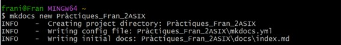
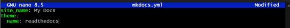

## Pràctica de desplegament de GitHub Pages

---

>***La pagina va modificant-se segons els estils aplicats i modificacions de les practiques, ja que la informació que hi ha en aquesta pràctica es simplement la base del projecte, on s'anirán fent canvis***

---

**Organitza la documentació de les teues pràctiques.**

Tinc totes les practiques passades a un mateix fitxer MarkDown, per a després amb un copia-pega poder crear els fitxers del projecte.

**Aquesta documentació serà un projecte de mkdocs.**

Els passos per a crear el projecte son els següents.

Editant el fitxer index.md, es pot afegir la informació markdown de les practiques, de primer per a començar es pot veure lo de la següent imatge.

D’aquesta manera la pagina es pot veure però el terminal bash es queda bloquejat, i al aturar-lo, la pagina ja no es troba disponible, per tant, vaig a crear un repositori nou a GitHub per a que no passe això.

**Utilitza un tema que t'agrade per a la visualització del teu lloc.**

Per a escollir un tema, al fitxer .yml, afegim la línia següent, amb el tema que he desitjat.

I així es veuria amb el tema aplicat (per a canviar-lo, simplement s’edita el fitxer anterior, seguit del comandament que hi ha abans).

**Desplega el teu lloc en Github Pages.**

Amb aquest comandament, usat anteriorment, despleguem el lloc a GitHub Pages.

També s'usa per a aplicar canvis nous.

L’enllaç al meu GitHub Pages es troba ací: [Pages](https://fransg006.github.io/Practiques_Fran_2ASIX/)
