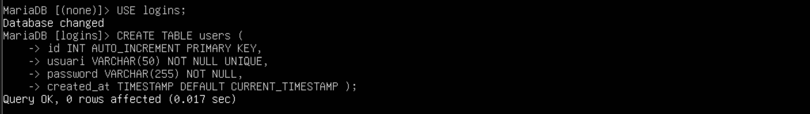
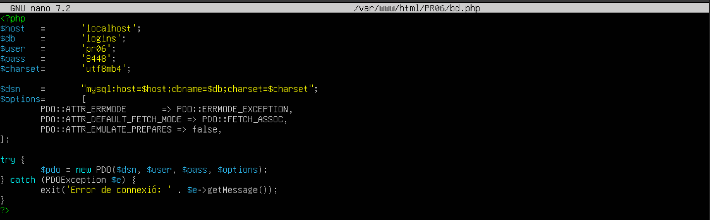
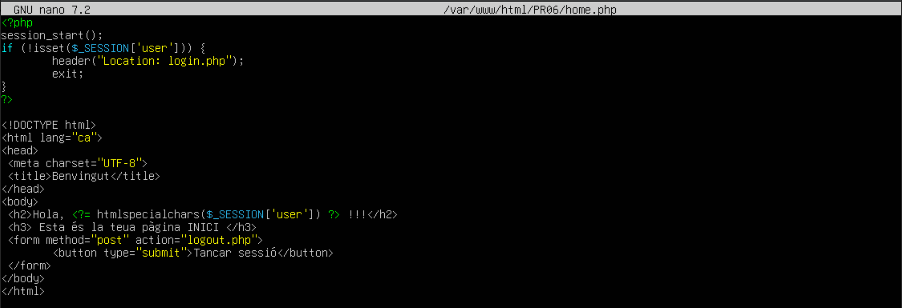

## Pràctica de login i resgistre d'usuaris

---

**Funcionalitats a implementar**

> • Formulari de Registre
- Validar que els camps d’entrada no estiguen buits.
- Assegurar-se que la contrasenya i la confirmació coincideixin abans de guardar-les.
- Guardar el nom d’usuari i la contrasenya (en format hash) a la base de dades.

> • Formulari de Login
- Validar les dades introduides, que siguen correctes.
- Verificar que l’usuari i la contrasenya coincideixin amb les dades guardades en la base de
dades.
- Si el login és correcte, s’iniciarà una sessió amb el nom de l’usuari.
- Mostrar un missatge, si el login falla, degut a usuari o password incorrectes.

> • Gestió de Sessions
- Utilitzar $_SESSION per mantenir l’estat de l’usuari una vegada loguejat.
- Assegurar-se que la sessió es tanque correctament al fer logout.

> • Seguretat
- Utilitza password_hash per a guardar les contrasenyes de forma segura.
- Utilitza password_verify per a comparar les contrasenyes al fer login.
- Valida totes les dades d’entrada per evitar injeccions SQL o atacs XSS.

---

A MariaDB vaig a crear la base de dades amb les dades requerides.
Primer crearé la base de dades:

Després usarem dita base de dades i crearem una taula d'aquesta manera amb les caracteristiques que es veuen a continuació

Ara al mateix lloc on ens trobem anem a crear un usuari per tal d'administrar aquesta base de dades.

El seguent pas, es accedir a phpmyadmin amb l'usuari creat.

I una vegada dins podem veure la base de dades creada amb la taula corresponent alhora.

Els fitxers que s'han implementat son els seguents:
~~~
bd.php
~~~

~~~
registre.php
~~~

~~~
login.php
~~~

~~~
home.php
~~~

~~~
logout.php
~~~

