## Pràctica de login i resgistre d'usuaris

---

**Funcionalitats a implementar**

> • Formulari de Registre

- Validar que els camps d’entrada no estiguen buits.
- Assegurar-se que la contrasenya i la confirmació coincideixin abans de guardar-les.
- Guardar el nom d’usuari i la contrasenya (en format hash) a la base de dades.

> • Formulari de Login

- Validar les dades introduides, que siguen correctes.
- Verificar que l’usuari i la contrasenya coincideixin amb les dades guardades en la base de
dades.
- Si el login és correcte, s’iniciarà una sessió amb el nom de l’usuari.
- Mostrar un missatge, si el login falla, degut a usuari o password incorrectes.

> • Gestió de Sessions

- Utilitzar $_SESSION per mantenir l’estat de l’usuari una vegada loguejat.
- Assegurar-se que la sessió es tanque correctament al fer logout.

> • Seguretat

- Utilitza password_hash per a guardar les contrasenyes de forma segura.
- Utilitza password_verify per a comparar les contrasenyes al fer login.
- Valida totes les dades d’entrada per evitar injeccions SQL o atacs XSS.

---

A MariaDB vaig a crear la base de dades amb les dades requerides.
Primer crearé la base de dades:

Després usarem dita base de dades i crearem una taula d'aquesta manera amb les caracteristiques que es veuen a continuació

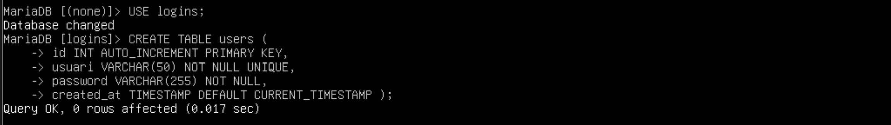

Ara al mateix lloc on ens trobem anem a crear un usuari per tal d'administrar aquesta base de dades.

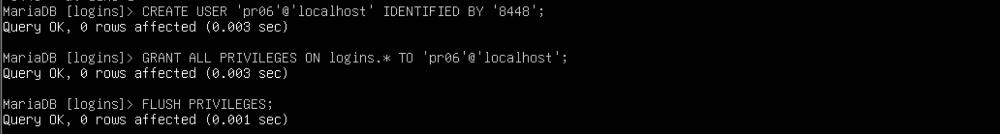

El seguent pas, es accedir a phpmyadmin amb l'usuari creat.

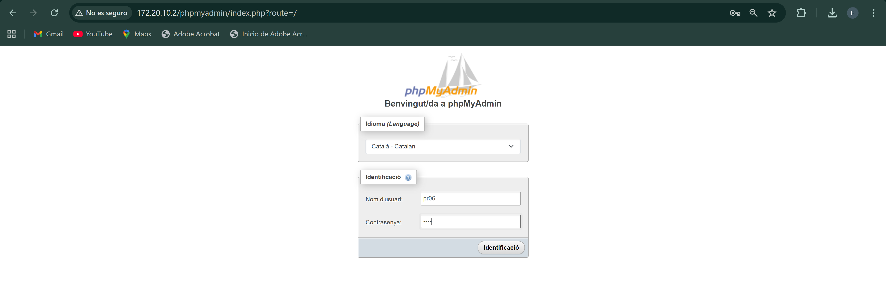

I una vegada dins podem veure la base de dades creada amb la taula corresponent alhora.

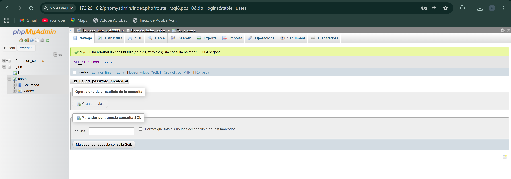

Els fitxers que s'han implementat son els seguents:
~~~
bd.php
~~~
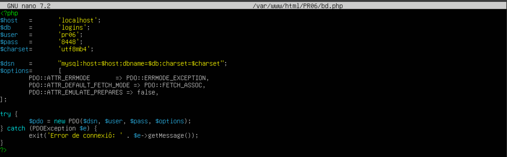
~~~
registre.php
~~~
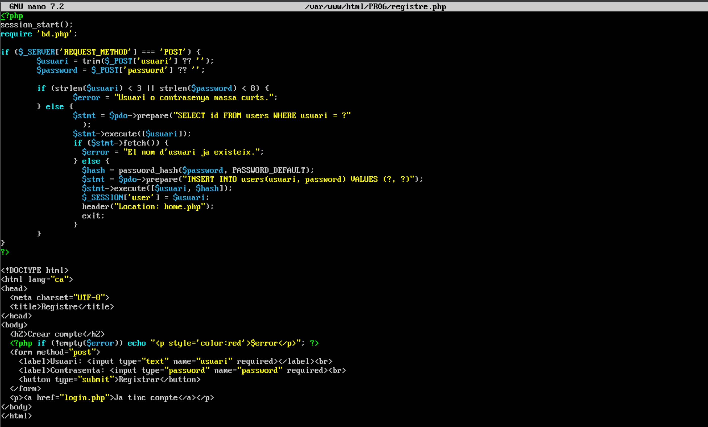
~~~
login.php
~~~
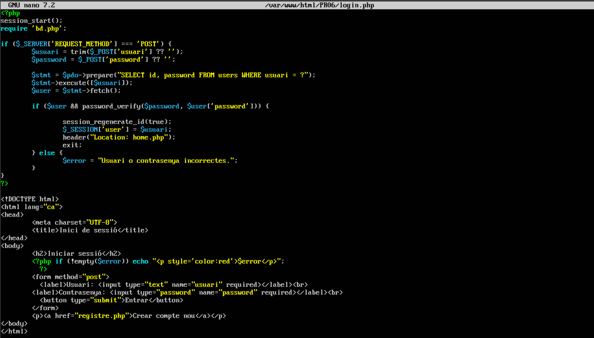
~~~
home.php
~~~
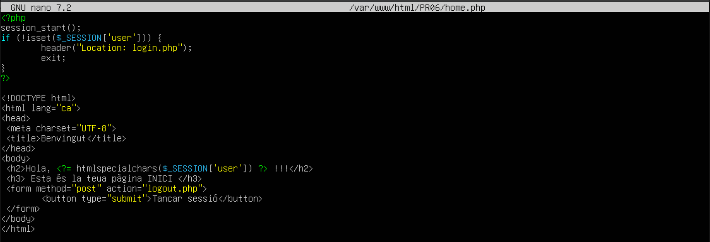
~~~
logout.php
~~~
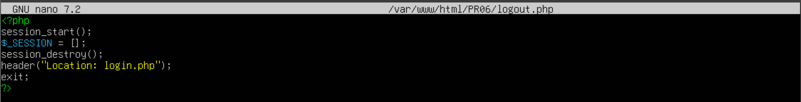

Després de ficar els fitxers, per a que funcione la pagina al navegador he creat este fitxer de configuració de nginx.

Es pot observar el port i el fitxer

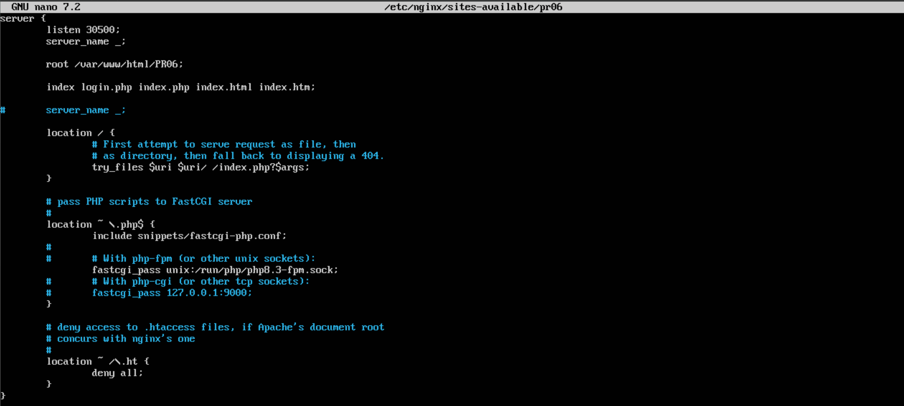

Després habilitem el lloc.

Ara podem veure la seguent pantalla en el navegador si accedim des del port 30500.

Podem crear un usuari primer, polsant a **Crear compte nou**.

*(Per a aquesta practica he creat a l'usuari que es veu per pantalla, amb la contrasenya *asix06.Fran*.)*

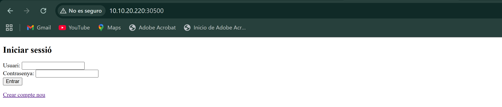

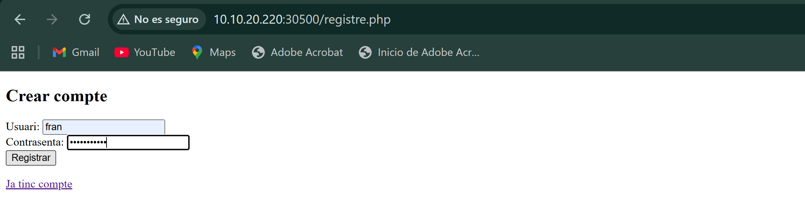

Després si accedim amb ell, ens mostra la seguent pantalla.

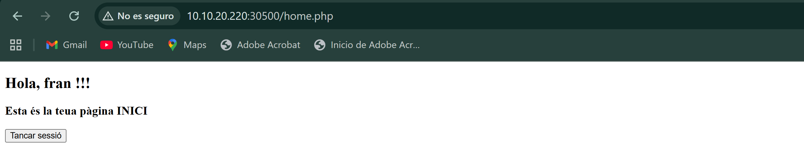

Com que la contrasenya del usuari que hem creat està activada per a que s'emmagatzeme a la base de dades com a hash, podem veure la seguent informació a la base de dades **logins** que hem creat abans.

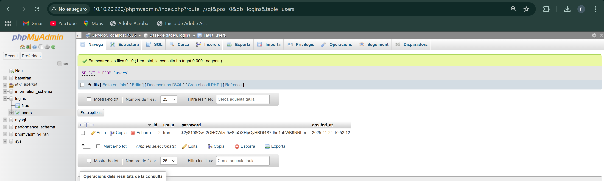

Per a fer més proves, podem probar amb l'inici de sessió.

Si tractem de connectar-nos amb l'usuari creat, o qualsevol que s'haja creat previament, veiem que podem accedir com es mostra 2 captures amunt.

Si tractem de connectar-nos amb un usuari que no existeix a la base de dades creada abans, veiem el seguent missatge, com que l'usuari no existeix:

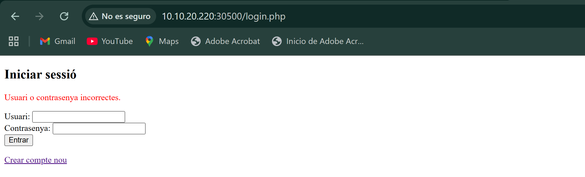

He creat diversos usuaris com a prova de la mateixa manera que abans, i els podem veure a la base de dades com es mostra a la seguent imatge.

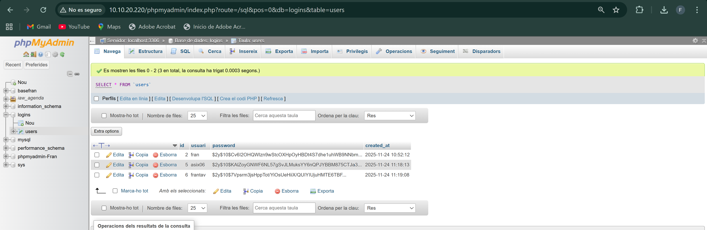

Amb els usuaris creats abans, funciona l'accés de forma automatica després de crear-los, com es veu a les seguents dues imatges.

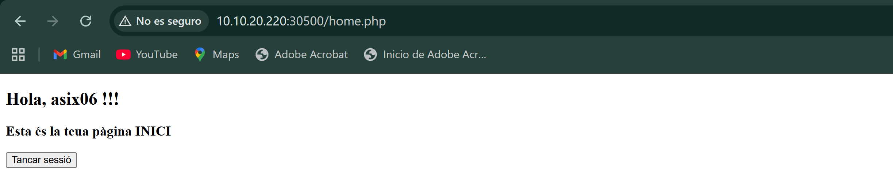

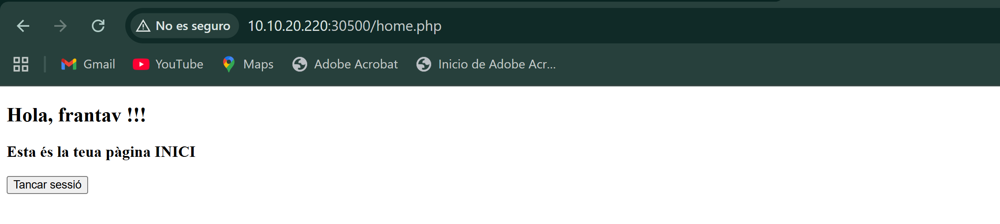

Però després de tancar sessió, ja no deixa connectar-se amb dits usuaris.