## Pràctica d'ús de phpmyadmin
### Ejercicios 2 - Enunciados

---

En esta lección se proponen ejercicios para practicar el uso de phpMyAdmin instalando pequeñas aplicaciones. Se pueden consultar las soluciones de estos ejercicios de phpMyAdmin, aunque se recomienda intentar realizarlos primero sin recurrir a estas soluciones.

**Administración de bases de datos on phpMyAdmin**

Las aplicaciones web que se abordan en este curso utilizan la base de datos MySQL/MariaDB. Por motivos de seguridad, en servidores reales no se recomienda que las aplicaciones se conecten a MySQL/MariaDB como usuario root. Para cada aplicación, es más recomendable crear un usuario en MySQL/MariaDB que administre la aplicación. Ese procedimiento es el que se utilizará en estos apuntes. Para crear esos usuarios y, en general, administrar MySQL/MariaDB, se utilizará la aplicación phpMyAdmin.

En esta lección se proponen ejercicios en los que se instalará varias veces una pequeña aplicación de agenda. En los ejercicios se plantean tres situaciones distintas:

> · Instalar y configurar manualmente la aplicación como usuario que sólo puede crear una base de datos.

> · Instalar y configurar manualmente dos aplicaciones como usuario que puede crear varias bases de datos.

> · Instalar y configurar manualmente dos aplicaciones como usuario que sólo puede crear una base de datos (es necesario además modificar la aplicación)

---

#### 2.1 - Crear un usuario iaw_agenda_1 con una base de datos única
Primero para acceder dentro de phpmyadmin, tenemos que pasar por dos identificaciones configuradas en la practica 4.
La primera, que es la que se ve en la siguiente captura, las credenciales son **franHT-8448**.

En esta pantalla la identificación será con las credenciales **fran-8448**.

**1. Cree un nuevo usuario de MySQL/MariaDB con la siguiente configuración**
>- nombre de usuario: iaw_agenda_1
>- servidor: localhost
>- contraseña: iaw_agenda_1
>- base de datos para el usuario: base de datos con el mismo nombre(iaw_agenda_1)
>- sin privilegios globales
>- sin límite de recursos

Primero, para crear dicha cuenta de usuario, nos tenemos que identificar como root, para que nos de permisos de configuración.
Una vez identificados como root-8448, vamos a Cuentas de usuario, y creamos uno con las caracteristicas requeridas.

De esta manera creamos el usuario y la base de datos que se muestra en el siguiente punto.

**2. Una vez creado el usuario, entre en phpMyAdmin como usuario iaw_agenda_1 y compruebe que se ha creado la base de datos iaw_agenda_1.**

De esta manera podemos ver el comando SQL y a su vez la base de datos creada.

**3. Como usuario iaw_agenda_1, compruebe que no puede borrar la base de datos, ni crear otra base de datos (por ejemplo, la base de datos iaw_agenda_1_db1).**

Primero me he logueado con el usuario creado iaw_agenda_1.

Una vez logueado con dicho usuario, he probado a crear una, y de hecho nos dice en el cuadro rojo inferior que no tenemos permisos para realizar esta operación.

Ahora he probado a eliminar la base de datos que hemos creado de forma automatica con el mismo nombre que el usuario a la misma vez que lo creamos, y nos sale lo mismo, que no podemos eliminar.

---

#### 2.2 - Instalar una aplicación como usuario iaw_agenda_1

**1. Descargue la aplicación Agenda (17/01/23) (esta aplicación corresponde al ejercicio Bases de datos (2 B) 2 del curso Programación web en PHP).**

**2. Descomprima la aplicación en la carpeta adecuada y renombre la carpeta como agenda-1.**

Primero en mi maquina anfitrion, he creado un servidor temporal de python en mi maquina para poder descargar la carpeta en el Ubuntu Server.

Después desde el Ubuntu Server he usado este comando para descargar la carpeta comprimida.

Seguidamente, procedo a descomprimir dicha carpeta.

Una vez ya tenemos la carpeta descomprimida, procedemos a situar dicha carpeta en el directorio de configuración correspondiente.

**3. Modifique el archivo de configuración config.php de la aplicación Agenda para que esta utilice la cuenta del usuario iaw_agenda_1 en MySQL/MariaDB.**

Para este paso, nos situamos dentro del directorio donde se encuentra el fichero config.php de la carpeta que hemos movido.

Una vez dentro ponemos dicha configuración como pide el enunciado, como se ve en la siguiente imagen.
En este caso lo que modificamos son las 4 ultimas lineas que salen en la captura, y en la primera linea donde elegimos el tipo de base de datos, ponemos MYSQL ya que es el tipo que usamos.

El siguiente paso será crear un fichero de configuración /etc/nginx/sites-available, en este caso llamado igual que la carpeta agenda-1.
Lo vamos a copiar del default que ya tenemos por defecto para usarlo de plantilla.

Una vez copiado el fichero, vamos a configurarlo para el sitio.

Después, para que nginx no coja el *default* por defecto, en /etc/nginx/sites-enabled, he borrado el default.

**4. Ejecute la aplicación en el navegador, eligiendo primero la opción "Borrar todo" para crear la tabla en la base de datos, y compruebe que funciona creando varios registros.**

Ahora desde el navegador, vamos a http://IPservidor/30000
*(La IP varía depende en que red me encuentre conectado en el momento)*

Elegimos la opción de borrar todo que se muestra en pantalla y aceptamos.

Después de borrar todo, podemos ver que nos sale lo siguiente:

**5. Compruebe el contenido de la tabla en phpMyAdmin como usuario iaw_agenda_1.**

Accedemos de nuevo dentro de phpmyadmin con dicho usuario:

Y comprobamos que el contenido de la tabla en phpmyadmin está vacio.

---

#### 2.3 - Crear un usuario iaw_agenda_2 que pueda administrar varias bases de datos
**1. Cree un nuevo usuario de MySQL/MariaDB con la siguiente configuración**
- nombre de usuario: iaw_agenda_2
- servidor: localhost
- contraseña: iaw_agenda_2
- base de datos para el usuario: Otorgar todos los privilegios al nombre que contiene comodín (username\_%)
- sin privilegios globales
- sin límite de recursos

Accedemos como root para poder crear usuarios

Una vez dentro creamos el usuario con dichas caracteristicas

**2. Una vez creado el usuario, entre en phpMyAdmin como usuario iaw_agenda_2 y compruebe que no se ha creado ninguna base de datos.**

Nos logueamos con dicho usuario iaw_agenda_2. 

Y vemos en la siguiente imagen que no hay ninguna base de datos creada ya que no hemos marcado la casilla que lo requeria.

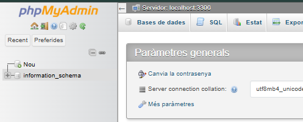

**3. Compruebe que el usuario iaw_agenda_2 no puede crear una base de datos cuyo nombre no empiece por iaw_agenda_2_, por ejemplo una base de datos que se llame agenda_2.**

Probamos a crear una base de datos con el nombre agenda_2 y vemos que nos sale lo siguiente diciendo que no nos deja crear una base de datos.

---

#### 2.4 - Instalar dos aplicaciones como usuario iaw_agenda_2
**1. Descargue la aplicación Agenda (17/01/23) (esta aplicación corresponde al ejercicio Bases de datos (2 B) 2 del curso Programación web en PHP).**

Como en el servidor ya tenia la carpeta comprimida descargada del principio de la actividad, pasamos al siguiente punto.

**2. Descomprima la aplicación dos veces en dos carpetas y renombre las carpetas como agenda-2a y agenda-2b.**

La he descomprimido 2 veces con esos nombres, como se ve en las siguientes 2 imagenes.

Copiamos los directorios creados, las ambas carpetas en /var/www/

**3. Modifique los archivos de configuración config.php de ambas aplicaciones para que estas utilicen la cuenta del usuario iaw_agenda_2 en MySQL/MariaDB (pero bases de datos distintas).**

* **Nota**: Hay que tener en cuenta que el nombre de las bases de datos debe comenzar por el nombre del usuario y un guion bajo (en este caso, iaw_agenda_2_agenda_2a y iaw_agenda_2_agenda_2b, por ejemplo)

* Para distinguir después una aplicación de otra fácilmente, puede cambiar el color básico de la aplicación en el archivo de configuración.

Primero he realizado estos cambios en los ficheros config.php de cada carpeta.

Una vez esos cambios realizados, en /etc/nginx/sites-available/ he duplicado el fichero agenda-1 con los respectivos nombres de cada una de ellas

Una vez tengamos los ficheros de nginx, voy a configurar el agenda-2a

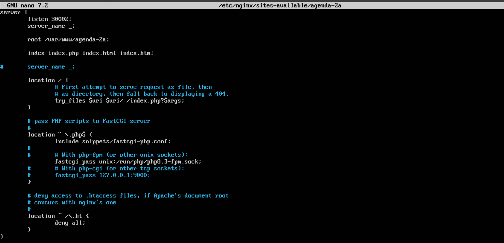

Ahora el fichero agenda-2b

Una vez configurados, los llevamos al /etc/nginx/sites-enabled para que los sitios web ya estén activos.

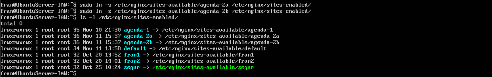

Luego en el CSS dentro del /var/www/agenda-2a y 2b, he realizado algunos cambios de color para que en las siguientes imagenes se vean diferente.
Esta imagen es en el CSS de agenda-2a.

Y se ve de esta manera.

Ahora en el CSS de agenda-2b he hecho estos cambios.

Y se ve asi.

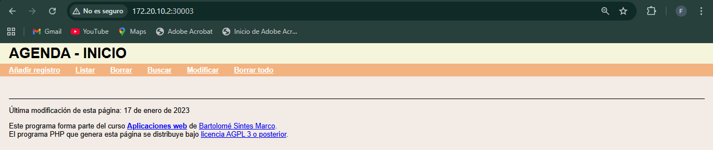

**4. Ejecute las aplicaciones en el navegador, eligiendo primero la opción "Borrar todo" para crear la tabla en la base de datos, y compruebe que funcionan creando varios registros.**
El borrado de las bases de datos con el *Borrar todo* se ve en las siguientes 2 capturas de las 2 aplicaciones web.

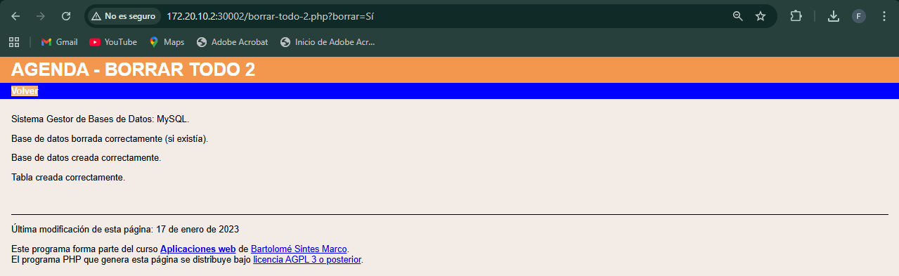

**5. Compruebe los contenidos de las tablas en phpMyAdmin como usuario iaw_agenda_2.**
Accedemos al phpmyadmin con dicho usuario.

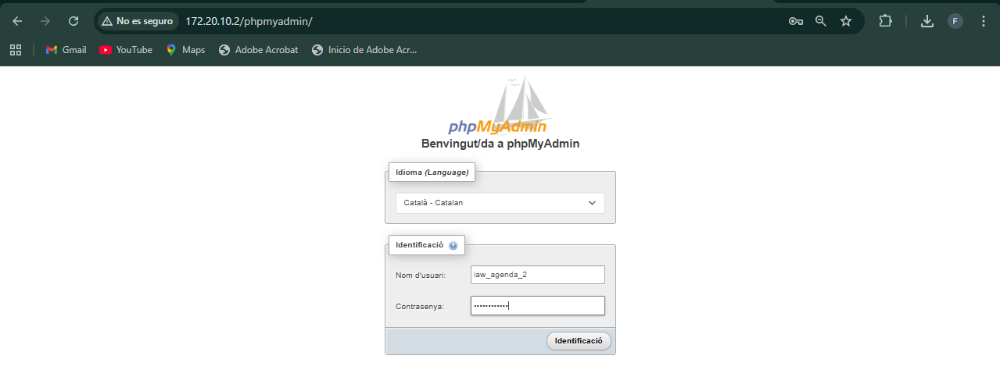

Una vez dentro, vemos el contenido de las tablas. En este caso podemos ver en la siguiente imagen que las tablas se encuentran vacias.

---

#### 2.5 - Crear un usuario iaw_agenda_3 con una base de datos única
**1. Cree un nuevo usuario de MySQL/MariaDB con la siguiente configuración**
- nombre de usuario: iaw_agenda_3
- servidor: localhost
- contraseña: iaw_agenda_3
- base de datos con el mismo nombre (iaw_agenda_3)
- sin privilegios globales
- sin límite de recursos

Volvemos a loguearnos como root en el phpmyadmin para poder crear usuarios.

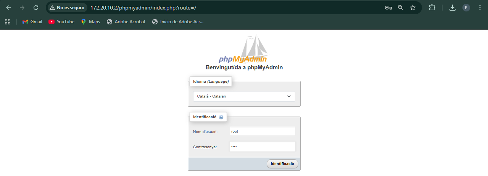

Una vez dentro creamos el usuario según lo pedido.

**2. Una vez creado el usuario, entre en phpMyAdmin como usuario iaw_agenda_3 y compruebe que se ha creado la base de datos iaw_agenda_3.**

Nos logueamos como iaw_agenda_3.

Vemos la base de datos creada.

---

#### 2.6 - Instalar dos aplicaciones como usuario iaw_agenda_3
**1. Descargue la aplicación Agenda (17/01/23) (esta aplicación corresponde al ejercicio Bases de datos (2 B) 2 del curso Programación web en PHP).**
La aplicación fue descargada en los primeros pasos.

**2. Descomprima la aplicación en dos carpetas y renombre las carpetas como agenda-3a y agenda-3b.**
Procedemos a descomprimir la carpeta, creando 2.

Seguidamente las movemos al directorio /var/www/.

**3. Modifique los archivos de configuración config.php para que las aplicaciones utilicen la cuenta del usuario iaw_agenda_3 en MySQL/MariaDB y la misma base de datos iaw_agenda_3, pero cada una guarde sus registros en tablas distintas.**
En las 2 siguientes imagenes se muestran los ficheros config.php en */var/www/agenda-3X/config.php*.

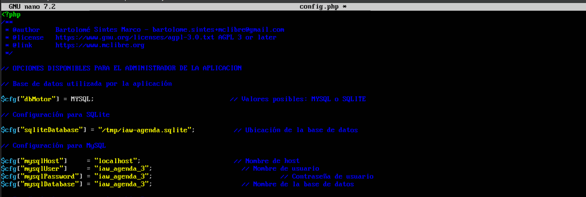

Ahora he duplicado el fichero que se encuentra en /etc/nginx/sites-available/ de agenda-1 para cada una de las apps, para 3a y 3b, con sus respectivas configuraciones en las siguientes imagenes.

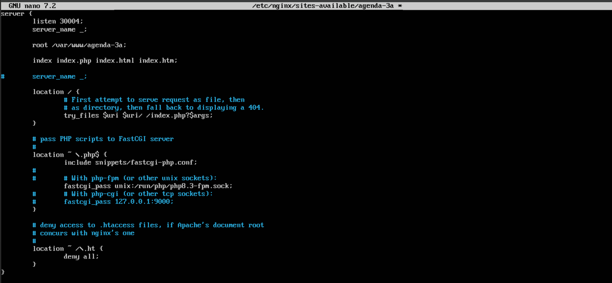

Después hay que llevar estos ficheros al sites-enabled para habilitarlos.

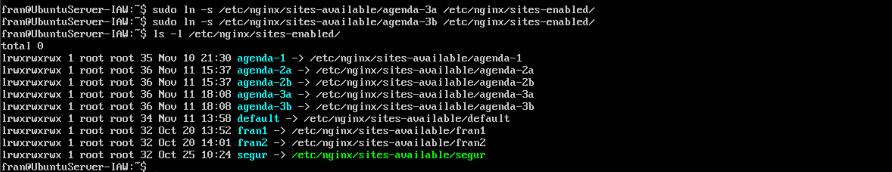

**4. Ejecute las aplicaciones en el navegador y compruebe que funcionan creando varios registros. El problema es que al borrar todo desde una aplicación se borra también la tabla de la otra aplicación.**
Ahora desde el navegador, poniendo la IP del servidor y el puerto que hemos configurado de cada sitio, vemos lo siguiente.

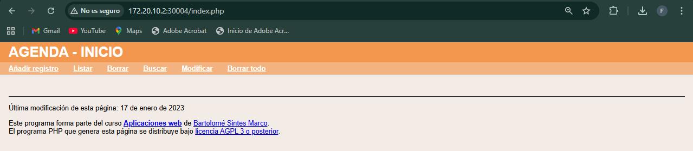

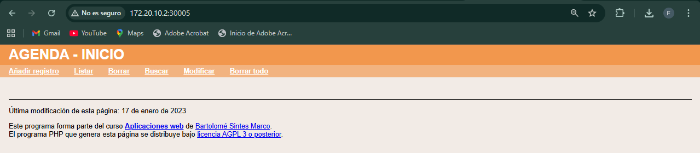

Ponemos *Borrar todo* en ambos sitios.

Ahora vamos a crear algún registro en agenda-3a por ejemplo

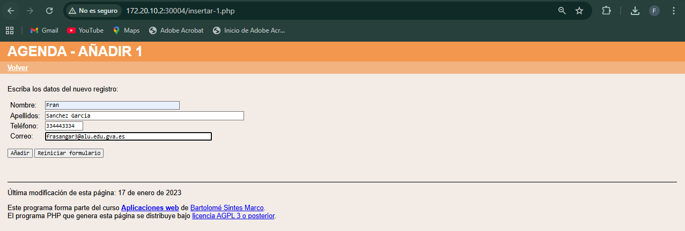

Después guardamos y vemos que se han guardado los cambios.

**5. Confirme el problema anterior comprobando los contenidos de las tablas en phpMyAdmin como usuario iaw_agenda_3**

Ahora nos logueamos con el usuario iaw_agenda_3.

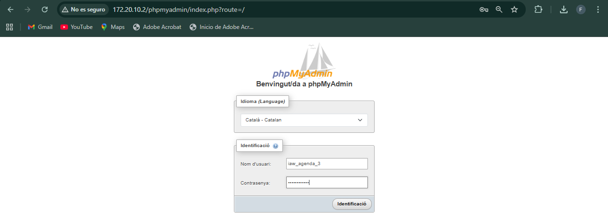

Podemos ver el registro creado en agenda-3a en la base de datos en la ultima linea que se ve en la siguiente imagen.

---

#### 2.7 - Mejora de las aplicaciones del usuario iaw_agenda_3

> **Usuario con un base de datos única**

**1. El problema de las aplicaciones del ejercicio 6 es que si se elige la opción "Borrar todo" en una de las aplicaciones se pierde toda la información de la otra aplicación, ya que al "Borrar todo" se borra la base de datos completa. Corrija este problema.**
La solución a este problema es borrar todo lo que marca la linea roja de la siguiente imagen:

Debe de quedar de esta manera en ambas bibliotecas.

Una vez borrado en los 2, no debemos de tener mas este problema.
Para comprobarlo, voy a pulsar *Borrar todo* en la de agenda-3b para ver si se borra el registro de agenda-3a.

Después de probarlo, podemos ver que el registro sigue sin haberlo perdido.

**2. Ejecute las aplicaciones en el navegador y compruebe que funcionan creando varios registros. Compruebe especialmente que al borrar todo desde una aplicación no se borran los registros de la otra.**
Para esta prueba voy a crear 2 registros en agenda-3a.

Ahora desde agenda-3b voy a probar a borrarlo todo.

Después de intentarlo, vemos que los registros siguen estando.

**3. Compruebe los contenidos de las tablas en phpMyAdmin como usuario iaw_agenda_3.**
Los contenidos siguen estando, como se ve en la imagen del punto de arriba.

> **Usuario con varias bases de datos (SIN HACER)**

**1. Si el usuario iaw_agenda_3 fuera del tipo de los que pueden tener muchas bases de datos, la solución del apartado anterior no sería suficiente, ya que las aplicaciones necesitan que exista la base de datos y las aplicaciones no las crean. Corrija este problema.**

**2. Borre el usuario usuario iaw_agenda_3 y créelo de nuevo, pero ahora del tipo de los que pueden crear varias bases de datos. Ejecute las aplicaciones en el navegador y compruebe que funcionan creando varios registros. Compruebe especialmente que al borrar todo desde una aplicación no se borran los registros de la otra.**

**3. Compruebe los contenidos de las tablas en phpMyAdmin como usuario iaw_agenda_3.**

---

### Ejercicios 3 - Enunciados

#### 3.1 - Completar instalación (SIN HACER)

**1. Para mantener la identificación de los usuarios en la base de datos, phpMyAdmin guarda una cookie en el cliente. Esta cookie está encriptada mediante el algoritmo AES, que requiere una cadenas sal aleatoria de 32 caracteres.**

**2. Elimine el aviso inicial que muestra phpMyAdmin.**

Aunque phpMyAdmin utiliza el algoritmo AES, la variable de configuración se llama blowfish_secret debido a que anteriormente phpMyAdmin utilizaba el algoritmo Blowfish. El manual de phpMyAdmin aconseja utilizar una cadena aleatoria de 32 caracteres, que puede generar utilizando algún generador Blowfish de los disponibles en Internet y modificándola para mayor seguridad.

**3. Compruebe que ya no se muestra el aviso.**

---

#### 3.2 - Instalar tema
**1. Aplique el tema Metro:**

**2. Descargue el tema darkwolf de la página de temas de phpMyAdmin y descomprímalo en la carpeta adecuada.**

*Si el tema darkwolf ya no está disponible en la web del programa, puede descargarlo desde la página de Descarga de aplicaciones.*

Primero en la pagina de temas de phpmyadmin descargo el tema en formato .zip
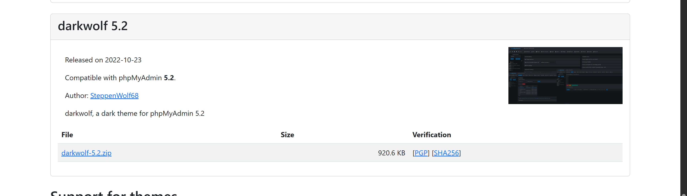

Después lo comparto comprimido con el servidor a través del servidor de pyhton3.

El siguiente paso es descomprimirlo, lo llamaré Darkwolf.

Ahora lo moveré al directorio siguiente para que se muestre en el menú de phpmyadmin para aplicarlo de la misma manera que el Metro.

**3. Aplique el tema darkwolf:**
Para que el tema aparezca, refrescamos la pagina y vemos que sale en el listado. Lo aplicamos.
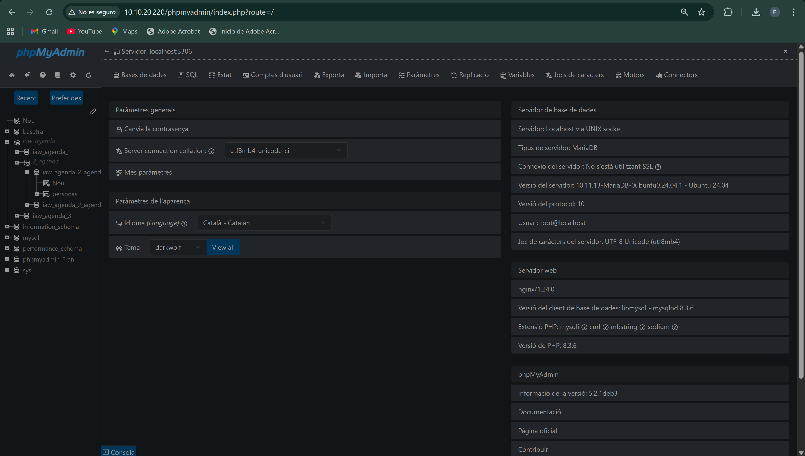

**4. Vuelva al tema predeterminado pmahomme.**
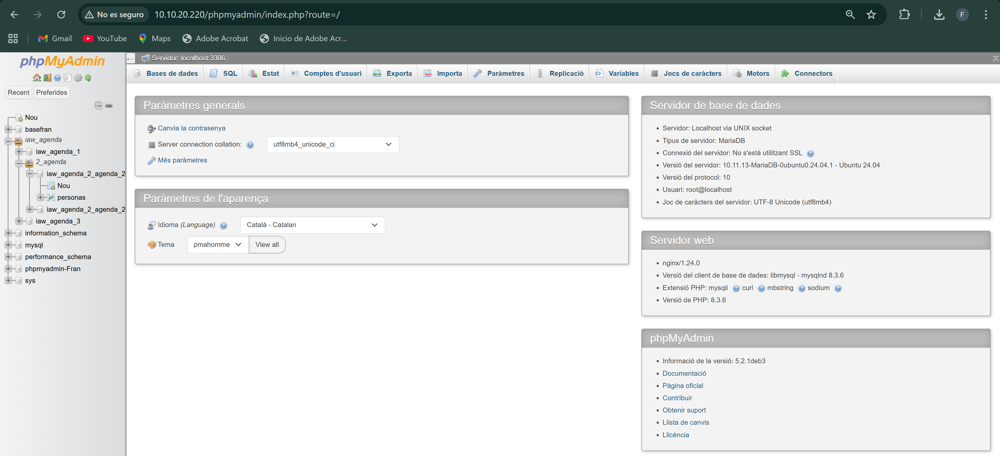

---

#### 3.3 - Permitir borrar bases de datos a los usuarios

**1. Como usuario root, compruebe que con phpMyAdmin podría borrar bases de datos (no borre ninguna ahora).**
Si nos situamos aqui, en operaciones, y vemos abajo del todo de la siguiente imagen que si que sale la opción de borrar la base de datos estando como root.

**2. Como usuario iaw_agenda_1 o iaw_agenda_2, compruebe que con phpMyAdmin no puede borrar sus bases de datos.**
Nos logueamos como iaw_agenda_1 y vemos que no sale la opción.

Lo mismo con iaw_agenda_2.

**3. El motivo es que con la configuración inicial, los usuarios no pueden borrar bases de datos. Pero estableciendo una variable de configuración en el archivo de configuración de phpMyAdmin, el usuario podrá borrar bases de datos.**

La variable de configuración se documenta en el manual de phpMyAdmin.

**4. Como usuario iaw_agenda_1 o iaw_agenda_2, compruebe que ya puede borrar sus bases de datos.
XAMPP. Borrar bases de datos**

**5. Deje el archivo de configuración de manera que los usuarios puedan borrar sus bases de datos, para poder hacer el ejercicio siguiente.**

---

#### 3.4 - Realizar copias de seguridad de las bases de datos del usuario iaw_agenda_2

**1. Compruebe que hay registros guardados en las tablas personas en ambas bases de datos.**
He creado un registro en cada tabla para que haya contenido en cada una de ellas.

**2. Copia de seguridad rápida**

- Realice una copia de seguridad rápida del usuario iaw_agenda_2
- Borre las bases de datos o las tablas de ambas aplicaciones.
- Restaure las copias de seguridad realizadas.
- Compruebe que los registros de las tablas se han r

Primero nos conectamos a phpmyadmin con el usuario iaw_agenda_2.
Después vamos a *Exportar* y ponemos las siguientes opciones.

Exportamos y vemos el fichero descargado.

Ahora vamos a borrar las bases de datos desde el usuario root, de la siguiente manera en ambas.
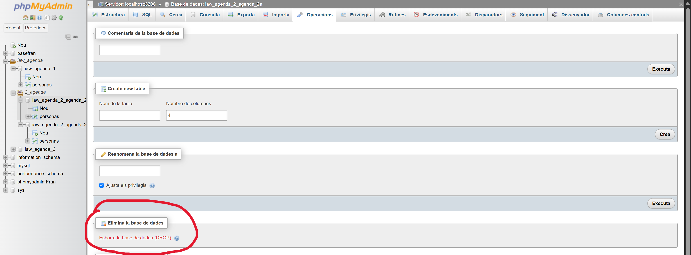

Si nos logueamos de nuevo con iaw_agenda_2, vemos que las bases de datos ya no aparecen.
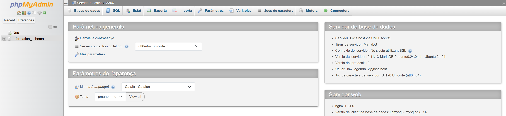

Ahora como root, vamos a restaurar con el fichero que hemos creado al exportar antes, en *Importar*:

Una vez importado de nuevo, desde root como se ve en la imagen superior, y al igual que desde iaw_agenda_2, vemos de nuevo las bases de datos, con sus correspondientes datos que hemos introducido antes.
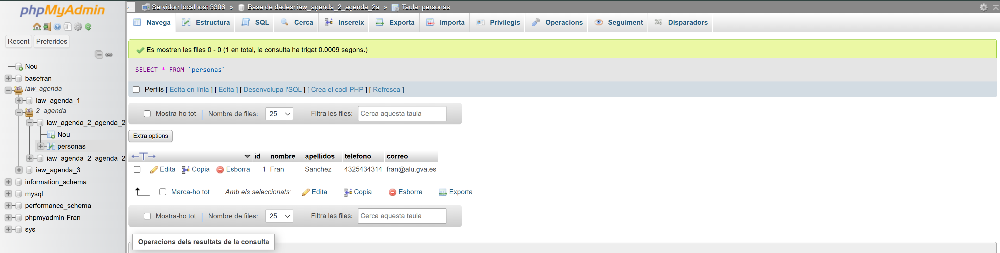

**3. Copia de seguridad personalizada completa**
- Realice una copia de seguridad personalizada de las bases de datos del usuario iaw_agenda_2 (incluyendo el borrado de las bases de datos y sus elementos).
- Borre las bases de datos o las tablas de ambas aplicaciones.
- Restaure las copias de seguridad realizadas.
- Compruebe que los registros de las tablas se han recuperado correctamente.

Para realizar este tipo de copia, elegimos la opción de *personalizada*, en la siguiente imagen.

En la siguiente imagen, para que sea una copia completa, es decir, de todo, marcamos *estructura i dades*.
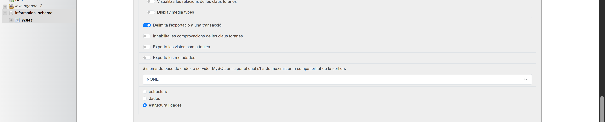

Ahora borramos las bases de datos como root de la misma forma que en el punto anterior.
Restauramos la copia igual que antes con *Importar*.
Vemos de nuevo que los registros de dichas tablas siguen estando.
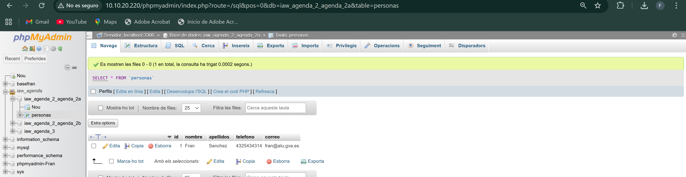

**4. Copia de seguridad personalizada parcial**
- Realice una copia de seguridad personalizada de una de las bases de datos del usuario iaw_agenda_2 (incluyendo el borrado de las bases de datos y sus elementos).
- Borre la base de datos o la tabla elegida.
- Restaure la copias de seguridad realizada.
- Compruebe que los registros de la tabla se han recuperado correctamente.
  
Realizamos el mismo procedimiento que en el punto anterior, pero esta vez elegimos la opción de *solo estructura*.

Una vez creado el fichero .sql, borramos las bases de datos de nuevo, y volvemos a importar el fichero.

Vemos que al importar el fichero de nuevo, la estructura la mantiene, pero los datos no.

---

#### 3.5 (optativo) - Generar PDFs de la estructura de las bases de datos
phpMyAdmin incluye un diseñador que muestra de forma gráfica la estructura de la base de datos y que también permite exportarla en formato PDF.

**1. Muestre la estructura de la base de datos iaw_agenda_1.**

**2. Exporte el pdf con la estructura de la base de datos iaw_agenda_1.**

En aquest enllaç, es pot accedir al document .pdf de la estructura de la base de dades: [PDF](Estructura-BaseDeDades1.pdf)