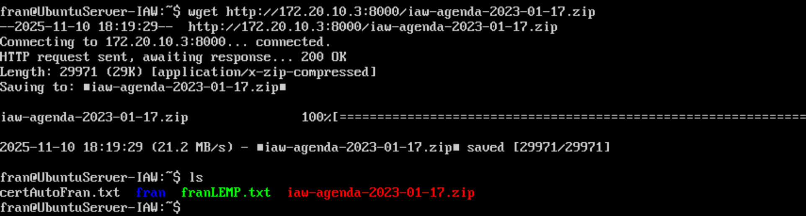
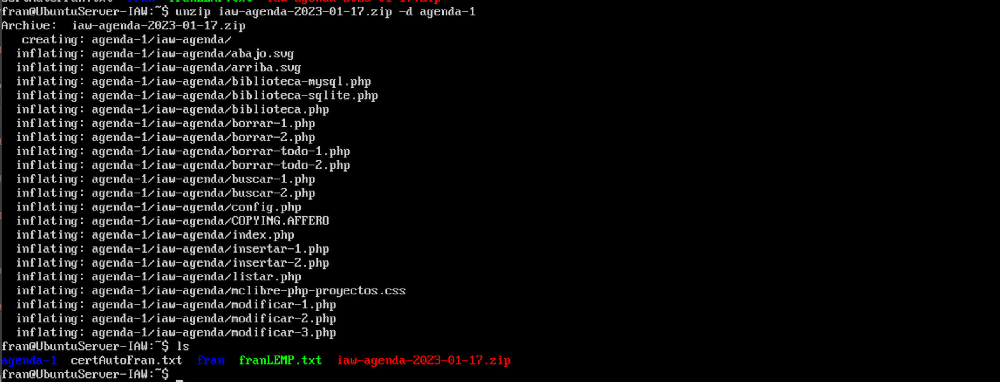

## Pràctica d'ús de phpmyadmin
## phpMyAdmin - Ejercicios (2) - Enunciados

---

En esta lección se proponen ejercicios para practicar el uso de phpMyAdmin instalando pequeñas aplicaciones. Se pueden consultar las soluciones de estos ejercicios de phpMyAdmin, aunque se recomienda intentar realizarlos primero sin recurrir a estas soluciones.

/// Administración de bases de datos on phpMyAdmin
> Las aplicaciones web que se abordan en este curso utilizan la base de datos MySQL/MariaDB. Por motivos de seguridad, en servidores reales no se recomienda que las aplicaciones se conecten a MySQL/MariaDB como usuario root. Para cada aplicación, es más recomendable crear un usuario en MySQL/MariaDB que administre la aplicación. Ese procedimiento es el que se utilizará en estos apuntes. Para crear esos usuarios y, en general, administrar MySQL/MariaDB, se utilizará la aplicación phpMyAdmin.

> En esta lección se proponen ejercicios en los que se instalará varias veces una pequeña aplicación de agenda. En los ejercicios se plantean tres situaciones distintas:

> · Instalar y configurar manualmente la aplicación como usuario que sólo puede crear una base de datos.
> · Instalar y configurar manualmente dos aplicaciones como usuario que puede crear varias bases de datos.
> · Instalar y configurar manualmente dos aplicaciones como usuario que sólo puede crear una base de datos (es necesario además modificar la aplicación)

#### phpMyAdmin (2) 1 - Crear un usuario iaw_agenda_1 con una base de datos única
Primero para acceder dentro de phpmyadmin, tenemos que pasar por dos identificaciones configuradas en la practica 4.
La primera, que es la que se ve en la siguiente captura, las credenciales son **franHT-8448**.

En esta pantalla la identificación será con las credenciales **fran-8448**.

**1. Cree un nuevo usuario de MySQL/MariaDB con la siguiente configuración**
>- nombre de usuario: iaw_agenda_1
>- servidor: localhost
>- contraseña: iaw_agenda_1
>- base de datos para el usuario: base de datos con el mismo nombre(iaw_agenda_1)
>- sin privilegios globales
>- sin límite de recursos

Primero, para crear dicha cuenta de usuario, nos tenemos que identificar como root, para que nos de permisos de configuración.
Una vez identificados como root-8448, vamos a Cuentas de usuario, y creamos uno con las caracteristicas requeridas.

De esta manera creamos el usuario y la base de datos que se muestra en el siguiente punto.

**2. Una vez creado el usuario, entre en phpMyAdmin como usuario iaw_agenda_1 y compruebe que se ha creado la base de datos iaw_agenda_1.**

De esta manera podemos ver el comando SQL y a su vez la base de datos creada.

**3. Como usuario iaw_agenda_1, compruebe que no puede borrar la base de datos, ni crear otra base de datos (por ejemplo, la base de datos iaw_agenda_1_db1).**

Primero me he logueado con el usuario creado iaw_agenda_1.

Una vez logueado con dicho usuario, he probado a crear una, y de hecho nos dice en el cuadro rojo inferior que no tenemos permisos para realizar esta operación.

Ahora he probado a eliminar la base de datos que hemos creado de forma automatica con el mismo nombre que el usuario a la misma vez que lo creamos, y nos sale lo mismo, que no podemos eliminar.

#### phpMyAdmin (2) 2 - Instalar una aplicación como usuario iaw_agenda_1
**1. Descargue la aplicación Agenda (17/01/23) (esta aplicación corresponde al ejercicio Bases de datos (2 B) 2 del curso Programación web en PHP).**

**2. Descomprima la aplicación en la carpeta adecuada y renombre la carpeta como agenda-1.**

Primero en mi maquina anfitrion, he creado un servidor temporal de python en mi maquina para poder descargar la carpeta en el Ubuntu Server.

Después desde el Ubuntu Server he usado este comando para descargar la carpeta comprimida.

Seguidamente, procedo a descomprimir dicha carpeta.

Una vez ya tenemos la carpeta descomprimida, procedemos a situar dicha carpeta en el directorio de configuración correspondiente.

**3. Modifique el archivo de configuración config.php de la aplicación Agenda para que esta utilice la cuenta del usuario iaw_agenda_1 en MySQL/MariaDB.**

Para este paso, nos situamos dentro del directorio donde se encuentra el fichero config.php de la carpeta que hemos movido.

Una vez dentro ponemos dicha configuración como pide el enunciado, como se ve en la siguiente imagen.
En este caso lo que modificamos son las 4 ultimas lineas que salen en la captura.

El siguiente paso será crear un fichero de configuración /etc/nginx/sites-available, en este caso llamado igual que la carpeta agenda-1.
Lo vamos a copiar del default que ya tenemos por defecto para usarlo de plantilla.

Una vez copiado el fichero, vamos a configurarlo para el sitio.

Después, para que nginx no coja el *default* por defecto, en /etc/nginx/sites-enabled, he borrado el default.

**4. Ejecute la aplicación en el navegador, eligiendo primero la opción "Borrar todo" para crear la tabla en la base de datos, y compruebe que funciona creando varios registros.**

Ahora desde el navegador, vamos a http://IPservidor/agenda-1
*(La IP varía depende en que red me encuentre conectado en el momento)*

Elegimos la opción de borrar todo que se muestra en pantalla y aceptamos.

***Sale error en la base de datos***

**5. Compruebe el contenido de la tabla en phpMyAdmin como usuario iaw_agenda_1.**

#### phpMyAdmin (2) 3 - Crear un usuario iaw_agenda_2 que pueda administrar varias bases de datos
1. Cree un nuevo usuario de MySQL/MariaDB con la siguiente configuración
- nombre de usuario: iaw_agenda_2
- servidor: localhost
- contraseña: iaw_agenda_2
- base de datos para el usuario: Otorgar todos los privilegios al nombre que contiene comodín (username\_%)
- sin privilegios globales
- sin límite de recursos

2. Una vez creado el usuario, entre en phpMyAdmin como usuario iaw_agenda_2 y compruebe que no se ha creado ninguna base de datos.

3. Compruebe que el usuario iaw_agenda_2 no puede crear una base de datos cuyo nombre no empiece por iaw_agenda_2_, por ejemplo una base de datos que se llame agenda_2.

#### phpMyAdmin (2) 4 - Instalar dos aplicaciones como usuario iaw_agenda_2
1. Descargue la aplicación Agenda (17/01/23) (esta aplicación corresponde al ejercicio Bases de datos (2 B) 2 del curso Programación web en PHP).

2. Descomprima la aplicación dos veces en dos carpetas y renombre las carpetas como agenda-2a y agenda-2b.

3. Modifique los archivos de configuración config.php de ambas aplicaciones para que estas utilicen la cuenta del usuario iaw_agenda_2 en MySQL/MariaDB (pero bases de datos distintas).
**Nota**: Hay que tener en cuenta que el nombre de las bases de datos debe comenzar por el nombre del usuario y un guion bajo (en este caso, iaw_agenda_2_agenda_2a y iaw_agenda_2_agenda_2b, por ejemplo)

Para distinguir después una aplicación de otra fácilmente, puede cambiar el color básico de la aplicación en el archivo de configuración.

4. Ejecute las aplicaciones en el navegador, eligiendo primero la opción "Borrar todo" para crear la tabla en la base de datos, y compruebe que funcionan creando varios registros.

5. Compruebe los contenidos de las tablas en phpMyAdmin como usuario iaw_agenda_2.

#### phpMyAdmin (2) 5 - Crear un usuario iaw_agenda_3 con una base de datos única
1. Cree un nuevo usuario de MySQL/MariaDB con la siguiente configuración
- nombre de usuario: iaw_agenda_3
- servidor: localhost
- contraseña: iaw_agenda_3
- base de datos con el mismo nombre (iaw_agenda_3)
- sin privilegios globales
- sin límite de recursos

2. Una vez creado el usuario, entre en phpMyAdmin como usuario iaw_agenda_3 y compruebe que se ha creado la base de datos iaw_agenda_3.

#### phpMyAdmin (2) 6 - Instalar dos aplicaciones como usuario iaw_agenda_3
1. Descargue la aplicación Agenda (17/01/23) (esta aplicación corresponde al ejercicio Bases de datos (2 B) 2 del curso Programación web en PHP).

2. Descomprima la aplicación en dos carpetas y renombre las carpetas como agenda-3a y agenda-3b.

3. Modifique los archivos de configuración config.php para que las aplicaciones utilicen la cuenta del usuario iaw_agenda_3 en MySQL/MariaDB y la misma base de datos iaw_agenda_3, pero cada una guarde sus registros en tablas distintas.

4. Ejecute las aplicaciones en el navegador y compruebe que funcionan creando varios registros. El problema es que al borrar todo desde una aplicación se borra también la tabla de la otra aplicación.

5. Confirme el problema anterior comprobando los contenidos de las tablas en phpMyAdmin como usuario iaw_agenda_3

#### phpMyAdmin (2) 7 - Mejora de las aplicaciones del usuario iaw_agenda_3
**Usuario con un base de datos única**

1. El problema de las aplicaciones del ejercicio 6 es que si se elige la opción "Borrar todo" en una de las aplicaciones se pierde toda la información de la otra aplicación, ya que al "Borrar todo" se borra la base de datos completa. Corrija este problema.
>> Ayuda (haga clic aquí si no se le ocurre cómo hacerlo)

2. Ejecute las aplicaciones en el navegador y compruebe que funcionan creando varios registros. Compruebe especialmente que al borrar todo desde una aplicación no se borran los registros de la otra.

3. Compruebe los contenidos de las tablas en phpMyAdmin como usuario iaw_agenda_3.

**Usuario con varias bases de datos**

1. Si el usuario iaw_agenda_3 fuera del tipo de los que pueden tener muchas bases de datos, la solución del apartado anterior no sería suficiente, ya que las aplicaciones necesitan que exista la base de datos y las aplicaciones no las crean. Corrija este problema.
>> Ayuda (haga clic aquí si no se le ocurre cómo hacerlo)

2. Borre el usuario usuario iaw_agenda_3 y créelo de nuevo, pero ahora del tipo de los que pueden crear varias bases de datos. Ejecute las aplicaciones en el navegador y compruebe que funcionan creando varios registros. Compruebe especialmente que al borrar todo desde una aplicación no se borran los registros de la otra.

3. Compruebe los contenidos de las tablas en phpMyAdmin como usuario iaw_agenda_3.

---

## phpMyAdmin - Ejercicios (3) - Enunciados

#### phpMyAdmin (3) 1 - Completar instalación
1. Para mantener la identificación de los usuarios en la base de datos, phpMyAdmin guarda una cookie en el cliente. Esta cookie está encriptada mediante el algoritmo AES, que requiere una cadenas sal aleatoria de 32 caracteres.

2. Elimine el aviso inicial que muestra phpMyAdmin.

Aunque phpMyAdmin utiliza el algoritmo AES, la variable de configuración se llama blowfish_secret debido a que anteriormente phpMyAdmin utilizaba el algoritmo Blowfish. El manual de phpMyAdmin aconseja utilizar una cadena aleatoria de 32 caracteres, que puede generar utilizando algún generador Blowfish de los disponibles en Internet y modificándola para mayor seguridad.

3. Compruebe que ya no se muestra el aviso.

#### phpMyAdmin (3) 2 - Instalar tema
1. Aplique el tema Metro:

2. Descargue el tema darkwolf de la página de temas de phpMyAdmin y descomprímalo en la carpeta adecuada.

Si el tema darkwolf ya no está disponible en la web del programa, puede descargarlo desde la página de Descarga de aplicaciones.

3. Aplique el tema darkwolf:

4. Vuelva al tema predeterminado pmahomme.

#### phpMyAdmin (3) 3 - Permitir borrar bases de datos a los usuarios

1. Como usuario root, compruebe que con phpMyAdmin podría borrar bases de datos (no borre ninguna ahora).
XAMPP. Borrar bases de datos

2. Como usuario iaw_agenda_1 o iaw_agenda_2, compruebe que con phpMyAdmin no puede borrar sus bases de datos.
XAMPP. Borrar bases de datos

3. El motivo es que con la configuración inicial, los usuarios no pueden borrar bases de datos. Pero estableciendo una variable de configuración en el archivo de configuración de phpMyAdmin, el usuario podrá borrar bases de datos.

La variable de configuración se documenta en el manual de phpMyAdmin.

>> Ayuda (haga clic aquí si no encuentra el nombre de la variable en la página del manual enlazada)

4. Como usuario iaw_agenda_1 o iaw_agenda_2, compruebe que ya puede borrar sus bases de datos.
XAMPP. Borrar bases de datos

5. Deje el archivo de configuración de manera que los usuarios puedan borrar sus bases de datos, para poder hacer el ejercicio siguiente.

#### phpMyAdmin (3) 4 - Realizar copias de seguridad de las bases de datos del usuario iaw_agenda_2

1. Compruebe que hay registros guardados en las tablas personas en ambas bases de datos.
 
2. Copia de seguridad rápida

- Realice una copia de seguridad rápida de del usuario iaw_agenda_2
- Borre las bases de datos o las tablas de ambas aplicaciones.
- Restaure las copias de seguridad realizadas.
- Compruebe que los registros de las tablas se han recuperado correctamente.

3. Copia de seguridad personalizada completa
- Realice una copia de seguridad personalizada de las bases de datos del usuario iaw_agenda_2 (incluyendo el borrado de las bases de datos y sus elementos).
- Borre las bases de datos o las tablas de ambas aplicaciones.
- Restaure las copias de seguridad realizadas.
- Compruebe que los registros de las tablas se han recuperado correctamente.

4. Copia de seguridad personalizada parcial
- Realice una copia de seguridad personalizada de una de las bases de datos del usuario iaw_agenda_2 (incluyendo el borrado de las bases de datos y sus elementos).
- Borre la base de datos o la tabla elegida.
- Restaure la copias de seguridad realizada.
- Compruebe que los registros de la tabla se han recuperado correctamente.

#### phpMyAdmin (3) 5 (optativo) - Generar PDFs de la estructura de las bases de datos
phpMyAdmin incluye un diseñador que muestra de forma gráfica la estructura de la base de datos y que también permite exportarla en formato PDF.

1. Muestre la estructura de la base de datos iaw_agenda_1.
phpMyAdmin. Generador

2. Exporte el pdf con la estructura de la base de datos iaw_agenda_1.
phpMyAdmin. Generador